# 🌐 Frontend Integration Guide: React/Next.js ↔ Backend APIs

## 📋 Overview

This comprehensive guide details how to connect a React/Next.js frontend application with the 에뷰리띵 backend APIs and Supabase database. The guide covers both **Admin** and **Service** API integrations with practical examples, authentication patterns, and best practices.

---

## 🏗️ Architecture Overview

```mermaid
graph TB
    subgraph "Frontend (React/Next.js)"
        A[Admin Dashboard] 
        B[Customer App]
        C[Shop Owner Portal]
    end
    
    subgraph "Backend APIs"
        D[Admin API<br/>🔒 /admin-docs]
        E[Service API<br/>🛍️ /service-docs]
        F[Complete API<br/>📚 /api-docs]
    end
    
    subgraph "Database & Services"
        G[Supabase PostgreSQL]
        H[Supabase Auth]
        I[Supabase Storage]
        J[Redis Cache]
    end
    
    A --> D
    B --> E
    C --> E
    D --> G
    E --> G
    D --> H
    E --> H
    E --> I
    D --> J
    E --> J
```



---

## 🔐 Authentication Setup

### **1. Supabase Client Configuration**

#### **Frontend Setup (`lib/supabase.ts`)**
```typescript
import { createClient } from '@supabase/supabase-js'

const supabaseUrl = process.env.NEXT_PUBLIC_SUPABASE_URL!
const supabaseAnonKey = process.env.NEXT_PUBLIC_SUPABASE_ANON_KEY!

export const supabase = createClient(supabaseUrl, supabaseAnonKey, {
  auth: {
    autoRefreshToken: true,
    persistSession: true,
    detectSessionInUrl: true
  }
})

// For admin operations (server-side only)
export const supabaseAdmin = createClient(
  supabaseUrl, 
  process.env.SUPABASE_SERVICE_ROLE_KEY!, // Server-side only
  {
    auth: {
      autoRefreshToken: false,
      persistSession: false
    }
  }
)
```

#### **Environment Variables (`.env.local`)**
```bash
# Public (client-side accessible)
NEXT_PUBLIC_SUPABASE_URL=https://ysrudwzwnzxrrwjtpuoh.supabase.co
NEXT_PUBLIC_SUPABASE_ANON_KEY=your_anon_key_here
NEXT_PUBLIC_BACKEND_URL=http://localhost:3000

# Private (server-side only)
SUPABASE_SERVICE_ROLE_KEY=your_service_role_key_here
BACKEND_ADMIN_SECRET=your_admin_secret_here
```

### **2. Authentication Context (`contexts/auth.tsx`)**
```typescript
'use client'

import { createContext, useContext, useEffect, useState } from 'react'
import { User, Session } from '@supabase/supabase-js'
import { supabase } from '@/lib/supabase'

interface AuthContextType {
  user: User | null
  session: Session | null
  loading: boolean
  isAdmin: boolean
  isShopOwner: boolean
  signIn: (email: string, password: string) => Promise<void>
  signOut: () => Promise<void>
  getAccessToken: () => Promise<string | null>
}

const AuthContext = createContext<AuthContextType | undefined>(undefined)

export function AuthProvider({ children }: { children: React.ReactNode }) {
  const [user, setUser] = useState<User | null>(null)
  const [session, setSession] = useState<Session | null>(null)
  const [loading, setLoading] = useState(true)
  const [userRole, setUserRole] = useState<string | null>(null)

  useEffect(() => {
    // Get initial session
    supabase.auth.getSession().then(({ data: { session } }) => {
      setSession(session)
      setUser(session?.user ?? null)
      if (session?.user) {
        fetchUserRole(session.user.id)
      }
      setLoading(false)
    })

    // Listen for auth changes
    const { data: { subscription } } = supabase.auth.onAuthStateChange(
      async (event, session) => {
        setSession(session)
        setUser(session?.user ?? null)
        if (session?.user) {
          await fetchUserRole(session.user.id)
        } else {
          setUserRole(null)
        }
        setLoading(false)
      }
    )

    return () => subscription.unsubscribe()
  }, [])

  const fetchUserRole = async (userId: string) => {
    try {
      const { data } = await supabase
        .from('users')
        .select('user_role')
        .eq('id', userId)
        .single()
      
      setUserRole(data?.user_role || 'user')
    } catch (error) {
      console.error('Error fetching user role:', error)
      setUserRole('user')
    }
  }

  const signIn = async (email: string, password: string) => {
    const { error } = await supabase.auth.signInWithPassword({
      email,
      password
    })
    if (error) throw error
  }

  const signOut = async () => {
    const { error } = await supabase.auth.signOut()
    if (error) throw error
  }

  const getAccessToken = async (): Promise<string | null> => {
    const { data: { session } } = await supabase.auth.getSession()
    return session?.access_token || null
  }

  const value = {
    user,
    session,
    loading,
    isAdmin: userRole === 'admin',
    isShopOwner: userRole === 'shop_owner',
    signIn,
    signOut,
    getAccessToken
  }

  return <AuthContext.Provider value={value}>{children}</AuthContext.Provider>
}

export const useAuth = () => {
  const context = useContext(AuthContext)
  if (context === undefined) {
    throw new Error('useAuth must be used within an AuthProvider')
  }
  return context
}
```

---

## 🔒 Admin API Integration

### **1. Admin API Client (`lib/admin-api.ts`)**
```typescript
import { supabaseAdmin } from '@/lib/supabase'

export interface AdminApiResponse<T = any> {
  success: boolean
  data?: T
  error?: {
    code: string
    message: string
    details?: any
  }
  timestamp: string
  requestId: string
}

export class AdminApiClient {
  private baseUrl: string
  private defaultHeaders: HeadersInit

  constructor() {
    this.baseUrl = process.env.NEXT_PUBLIC_BACKEND_URL + '/api/admin'
    this.defaultHeaders = {
      'Content-Type': 'application/json',
      'X-API-Source': 'Admin-Frontend'
    }
  }

  /**
   * Make authenticated admin API request
   */
  private async makeRequest<T>(
    endpoint: string,
    options: RequestInit = {}
  ): Promise<AdminApiResponse<T>> {
    try {
      // Get admin session token
      const { data: { session } } = await supabaseAdmin.auth.getSession()
      
      if (!session) {
        throw new Error('Admin authentication required')
      }

      const response = await fetch(`${this.baseUrl}${endpoint}`, {
        ...options,
        headers: {
          ...this.defaultHeaders,
          Authorization: `Bearer ${session.access_token}`,
          ...options.headers
        }
      })

      const data = await response.json()

      if (!response.ok) {
        throw new Error(data.error?.message || 'Admin API request failed')
      }

      return data
    } catch (error) {
      console.error('Admin API request failed:', error)
      throw error
    }
  }

  // User Management APIs
  async getUsers(params: {
    page?: number
    limit?: number
    search?: string
    role?: string
    status?: string
  } = {}) {
    const queryParams = new URLSearchParams(
      Object.entries(params).filter(([_, v]) => v !== undefined) as [string, string][]
    )
    
    return this.makeRequest(`/users?${queryParams}`)
  }

  async updateUserStatus(userId: string, data: {
    newStatus: string
    reason: string
    notes?: string
  }) {
    return this.makeRequest(`/users/${userId}/status`, {
      method: 'PUT',
      body: JSON.stringify(data)
    })
  }

  async bulkUpdateUserStatus(data: {
    userIds: string[]
    newStatus: string
    reason: string
  }) {
    return this.makeRequest('/users/bulk-status', {
      method: 'PUT',
      body: JSON.stringify(data)
    })
  }

  // Shop Management APIs
  async getShops(params: {
    page?: number
    limit?: number
    status?: string
    category?: string
    location?: string
  } = {}) {
    const queryParams = new URLSearchParams(
      Object.entries(params).filter(([_, v]) => v !== undefined) as [string, string][]
    )
    
    return this.makeRequest(`/shops?${queryParams}`)
  }

  async approveShop(shopId: string, data: {
    approved: boolean
    notes?: string
    conditions?: string[]
  }) {
    return this.makeRequest(`/shops/${shopId}/approval`, {
      method: 'PUT',
      body: JSON.stringify(data)
    })
  }

  // Reservation Management APIs
  async getReservations(params: {
    page?: number
    limit?: number
    status?: string
    shopId?: string
    userId?: string
    startDate?: string
    endDate?: string
  } = {}) {
    const queryParams = new URLSearchParams(
      Object.entries(params).filter(([_, v]) => v !== undefined) as [string, string][]
    )
    
    return this.makeRequest(`/reservations?${queryParams}`)
  }

  async updateReservationStatus(reservationId: string, data: {
    status: string
    notes?: string
    reason?: string
  }) {
    return this.makeRequest(`/reservations/${reservationId}/status`, {
      method: 'PUT',
      body: JSON.stringify(data)
    })
  }

  // Financial Management APIs
  async getPaymentOverview(params: {
    startDate?: string
    endDate?: string
    shopId?: string
  } = {}) {
    const queryParams = new URLSearchParams(
      Object.entries(params).filter(([_, v]) => v !== undefined) as [string, string][]
    )
    
    return this.makeRequest(`/financial/payments/overview?${queryParams}`)
  }

  async getPointSystemOverview(params: {
    startDate?: string
    endDate?: string
    userId?: string
  } = {}) {
    const queryParams = new URLSearchParams(
      Object.entries(params).filter(([_, v]) => v !== undefined) as [string, string][]
    )
    
    return this.makeRequest(`/financial/points/overview?${queryParams}`)
  }

  async processPointAdjustment(data: {
    userId: string
    amount: number
    adjustmentType: 'add' | 'subtract' | 'expire'
    reason: string
    category: string
    notes?: string
  }) {
    return this.makeRequest('/financial/points/adjust', {
      method: 'POST',
      body: JSON.stringify(data)
    })
  }

  // Analytics APIs
  async getDashboardMetrics(params: {
    startDate?: string
    endDate?: string
    period?: 'day' | 'week' | 'month' | 'quarter' | 'year'
  } = {}) {
    const queryParams = new URLSearchParams(
      Object.entries(params).filter(([_, v]) => v !== undefined) as [string, string][]
    )
    
    return this.makeRequest(`/analytics/dashboard?${queryParams}`)
  }

  // Security Management APIs
  async getSecurityStats() {
    return this.makeRequest('/security-enhanced/stats')
  }

  async invalidateUserSessions(userId: string, data: {
    reason?: string
    keepCurrentSession?: boolean
    eventType?: string
  }) {
    return this.makeRequest(`/security/users/${userId}/invalidate-sessions`, {
      method: 'POST',
      body: JSON.stringify(data)
    })
  }
}

// Export singleton instance
export const adminApi = new AdminApiClient()
```

### **2. Admin React Hooks (`hooks/admin.ts`)**
```typescript
import { useState, useEffect } from 'react'
import { adminApi } from '@/lib/admin-api'
import { useAuth } from '@/contexts/auth'

export function useAdminUsers(params: {
  page?: number
  limit?: number
  search?: string
  role?: string
  status?: string
} = {}) {
  const [users, setUsers] = useState([])
  const [loading, setLoading] = useState(true)
  const [error, setError] = useState<string | null>(null)
  const [pagination, setPagination] = useState({
    totalCount: 0,
    hasMore: false,
    currentPage: 1,
    totalPages: 1
  })

  const { isAdmin } = useAuth()

  useEffect(() => {
    if (!isAdmin) {
      setError('Admin access required')
      setLoading(false)
      return
    }

    fetchUsers()
  }, [params, isAdmin])

  const fetchUsers = async () => {
    try {
      setLoading(true)
      setError(null)
      
      const response = await adminApi.getUsers(params)
      
      if (response.success && response.data) {
        setUsers(response.data.users || [])
        setPagination({
          totalCount: response.data.totalCount || 0,
          hasMore: response.data.hasMore || false,
          currentPage: response.data.currentPage || 1,
          totalPages: response.data.totalPages || 1
        })
      } else {
        setError(response.error?.message || 'Failed to fetch users')
      }
    } catch (err) {
      setError(err instanceof Error ? err.message : 'Unknown error')
    } finally {
      setLoading(false)
    }
  }

  const updateUserStatus = async (userId: string, data: {
    newStatus: string
    reason: string
    notes?: string
  }) => {
    try {
      const response = await adminApi.updateUserStatus(userId, data)
      if (response.success) {
        await fetchUsers() // Refresh the list
        return true
      } else {
        throw new Error(response.error?.message || 'Failed to update user status')
      }
    } catch (error) {
      console.error('Error updating user status:', error)
      throw error
    }
  }

  return {
    users,
    loading,
    error,
    pagination,
    refetch: fetchUsers,
    updateUserStatus
  }
}

export function useAdminDashboard(params: {
  startDate?: string
  endDate?: string
  period?: 'day' | 'week' | 'month' | 'quarter' | 'year'
} = {}) {
  const [metrics, setMetrics] = useState(null)
  const [loading, setLoading] = useState(true)
  const [error, setError] = useState<string | null>(null)

  const { isAdmin } = useAuth()

  useEffect(() => {
    if (!isAdmin) {
      setError('Admin access required')
      setLoading(false)
      return
    }

    fetchDashboardMetrics()
  }, [params, isAdmin])

  const fetchDashboardMetrics = async () => {
    try {
      setLoading(true)
      setError(null)
      
      const response = await adminApi.getDashboardMetrics(params)
      
      if (response.success) {
        setMetrics(response.data)
      } else {
        setError(response.error?.message || 'Failed to fetch dashboard metrics')
      }
    } catch (err) {
      setError(err instanceof Error ? err.message : 'Unknown error')
    } finally {
      setLoading(false)
    }
  }

  return {
    metrics,
    loading,
    error,
    refetch: fetchDashboardMetrics
  }
}
```

### **3. Admin Dashboard Components**

#### **User Management Component (`components/admin/UserManagement.tsx`)**
```tsx
'use client'

import { useState } from 'react'
import { useAdminUsers } from '@/hooks/admin'
import { Button } from '@/components/ui/button'
import { Input } from '@/components/ui/input'
import { Select, SelectContent, SelectItem, SelectTrigger, SelectValue } from '@/components/ui/select'
import { Table, TableBody, TableCell, TableHead, TableHeader, TableRow } from '@/components/ui/table'
import { Badge } from '@/components/ui/badge'
import { Card, CardContent, CardDescription, CardHeader, CardTitle } from '@/components/ui/card'

export function UserManagement() {
  const [filters, setFilters] = useState({
    page: 1,
    limit: 20,
    search: '',
    role: '',
    status: ''
  })

  const { users, loading, error, pagination, refetch, updateUserStatus } = useAdminUsers(filters)

  const handleStatusUpdate = async (userId: string, newStatus: string) => {
    try {
      await updateUserStatus(userId, {
        newStatus,
        reason: `Status updated to ${newStatus} by admin`,
        notes: 'Updated via admin dashboard'
      })
      
      // Show success notification
      alert('User status updated successfully')
    } catch (error) {
      alert('Failed to update user status: ' + (error as Error).message)
    }
  }

  const getStatusBadgeVariant = (status: string) => {
    switch (status) {
      case 'active': return 'default'
      case 'inactive': return 'secondary'
      case 'suspended': return 'destructive'
      case 'deleted': return 'outline'
      default: return 'secondary'
    }
  }

  if (loading) return <div>Loading users...</div>
  if (error) return <div>Error: {error}</div>

  return (
    <Card>
      <CardHeader>
        <CardTitle>User Management</CardTitle>
        <CardDescription>
          Manage user accounts, roles, and status
        </CardDescription>
      </CardHeader>
      <CardContent>
        {/* Filters */}
        <div className="flex gap-4 mb-6">
          <Input
            placeholder="Search users..."
            value={filters.search}
            onChange={(e) => setFilters(prev => ({ ...prev, search: e.target.value, page: 1 }))}
            className="max-w-sm"
          />
          
          <Select value={filters.role} onValueChange={(value) => setFilters(prev => ({ ...prev, role: value, page: 1 }))}>
            <SelectTrigger className="w-[180px]">
              <SelectValue placeholder="Filter by role" />
            </SelectTrigger>
            <SelectContent>
              <SelectItem value="">All Roles</SelectItem>
              <SelectItem value="user">User</SelectItem>
              <SelectItem value="shop_owner">Shop Owner</SelectItem>
              <SelectItem value="admin">Admin</SelectItem>
              <SelectItem value="influencer">Influencer</SelectItem>
            </SelectContent>
          </Select>

          <Select value={filters.status} onValueChange={(value) => setFilters(prev => ({ ...prev, status: value, page: 1 }))}>
            <SelectTrigger className="w-[180px]">
              <SelectValue placeholder="Filter by status" />
            </SelectTrigger>
            <SelectContent>
              <SelectItem value="">All Status</SelectItem>
              <SelectItem value="active">Active</SelectItem>
              <SelectItem value="inactive">Inactive</SelectItem>
              <SelectItem value="suspended">Suspended</SelectItem>
              <SelectItem value="deleted">Deleted</SelectItem>
            </SelectContent>
          </Select>

          <Button onClick={refetch} variant="outline">
            Refresh
          </Button>
        </div>

        {/* Users Table */}
        <Table>
          <TableHeader>
            <TableRow>
              <TableHead>User</TableHead>
              <TableHead>Role</TableHead>
              <TableHead>Status</TableHead>
              <TableHead>Points</TableHead>
              <TableHead>Last Login</TableHead>
              <TableHead>Actions</TableHead>
            </TableRow>
          </TableHeader>
          <TableBody>
            {users.map((user: any) => (
              <TableRow key={user.id}>
                <TableCell>
                  <div>
                    <div className="font-medium">{user.name}</div>
                    <div className="text-sm text-gray-500">{user.email}</div>
                  </div>
                </TableCell>
                <TableCell>
                  <Badge variant="outline">{user.userRole}</Badge>
                </TableCell>
                <TableCell>
                  <Badge variant={getStatusBadgeVariant(user.userStatus)}>
                    {user.userStatus}
                  </Badge>
                </TableCell>
                <TableCell>{user.totalPoints?.toLocaleString()}</TableCell>
                <TableCell>
                  {user.lastLoginAt ? new Date(user.lastLoginAt).toLocaleDateString() : 'Never'}
                </TableCell>
                <TableCell>
                  <div className="flex gap-2">
                    {user.userStatus !== 'suspended' && (
                      <Button
                        size="sm"
                        variant="destructive"
                        onClick={() => handleStatusUpdate(user.id, 'suspended')}
                      >
                        Suspend
                      </Button>
                    )}
                    {user.userStatus === 'suspended' && (
                      <Button
                        size="sm"
                        variant="default"
                        onClick={() => handleStatusUpdate(user.id, 'active')}
                      >
                        Activate
                      </Button>
                    )}
                  </div>
                </TableCell>
              </TableRow>
            ))}
          </TableBody>
        </Table>

        {/* Pagination */}
        <div className="flex items-center justify-between mt-4">
          <div className="text-sm text-gray-500">
            Showing {((pagination.currentPage - 1) * filters.limit) + 1} to{' '}
            {Math.min(pagination.currentPage * filters.limit, pagination.totalCount)} of{' '}
            {pagination.totalCount} users
          </div>
          
          <div className="flex gap-2">
            <Button
              variant="outline"
              size="sm"
              disabled={pagination.currentPage <= 1}
              onClick={() => setFilters(prev => ({ ...prev, page: prev.page - 1 }))}
            >
              Previous
            </Button>
            <Button
              variant="outline"
              size="sm"
              disabled={!pagination.hasMore}
              onClick={() => setFilters(prev => ({ ...prev, page: prev.page + 1 }))}
            >
              Next
            </Button>
          </div>
        </div>
      </CardContent>
    </Card>
  )
}
```

---

## 🛍️ Service API Integration

### **1. Service API Client (`lib/service-api.ts`)**
```typescript
import { supabase } from '@/lib/supabase'

export interface ServiceApiResponse<T = any> {
  success: boolean
  data?: T
  error?: {
    code: string
    message: string
    details?: any
  }
  timestamp: string
  requestId: string
}

export class ServiceApiClient {
  private baseUrl: string
  private defaultHeaders: HeadersInit

  constructor() {
    this.baseUrl = process.env.NEXT_PUBLIC_BACKEND_URL + '/api'
    this.defaultHeaders = {
      'Content-Type': 'application/json',
      'X-API-Source': 'Service-Frontend'
    }
  }

  /**
   * Make authenticated service API request
   */
  private async makeRequest<T>(
    endpoint: string,
    options: RequestInit = {}
  ): Promise<ServiceApiResponse<T>> {
    try {
      // Get user session token
      const { data: { session } } = await supabase.auth.getSession()
      
      const headers: HeadersInit = { ...this.defaultHeaders }
      
      if (session) {
        headers.Authorization = `Bearer ${session.access_token}`
      }

      const response = await fetch(`${this.baseUrl}${endpoint}`, {
        ...options,
        headers: {
          ...headers,
          ...options.headers
        }
      })

      const data = await response.json()

      if (!response.ok) {
        throw new Error(data.error?.message || 'Service API request failed')
      }

      return data
    } catch (error) {
      console.error('Service API request failed:', error)
      throw error
    }
  }

  // Authentication APIs
  async register(data: {
    email: string
    password: string
    name: string
    phoneNumber: string
    referralCode?: string
  }) {
    return this.makeRequest('/registration/register', {
      method: 'POST',
      body: JSON.stringify(data)
    })
  }

  async socialLogin(data: {
    provider: 'kakao' | 'naver' | 'google'
    accessToken: string
    deviceInfo?: any
  }) {
    return this.makeRequest('/auth/social-login', {
      method: 'POST',
      body: JSON.stringify(data)
    })
  }

  // Shop Discovery APIs
  async searchShops(params: {
    query?: string
    category?: string
    location?: string
    latitude?: number
    longitude?: number
    radius?: number
    page?: number
    limit?: number
  } = {}) {
    const queryParams = new URLSearchParams(
      Object.entries(params).filter(([_, v]) => v !== undefined).map(([k, v]) => [k, String(v)])
    )
    
    return this.makeRequest(`/shops/search?${queryParams}`)
  }

  async getShopDetails(shopId: string) {
    return this.makeRequest(`/shops/${shopId}`)
  }

  async getShopServices(shopId: string) {
    return this.makeRequest(`/shops/${shopId}/services`)
  }

  // Reservation APIs
  async getAvailableSlots(shopId: string, params: {
    date: string
    serviceIds: string[]
    startTime?: string
    endTime?: string
  }) {
    const queryParams = new URLSearchParams({
      date: params.date,
      serviceIds: params.serviceIds.join(','),
      ...(params.startTime && { startTime: params.startTime }),
      ...(params.endTime && { endTime: params.endTime })
    })
    
    return this.makeRequest(`/shops/${shopId}/available-slots?${queryParams}`)
  }

  async createReservation(data: {
    shopId: string
    serviceIds: string[]
    reservationDate: string
    reservationTime: string
    specialRequests?: string
    pointsToUse?: number
  }) {
    return this.makeRequest('/reservations', {
      method: 'POST',
      body: JSON.stringify(data)
    })
  }

  async getUserReservations(params: {
    status?: string
    startDate?: string
    endDate?: string
    page?: number
    limit?: number
  } = {}) {
    const queryParams = new URLSearchParams(
      Object.entries(params).filter(([_, v]) => v !== undefined) as [string, string][]
    )
    
    return this.makeRequest(`/reservations?${queryParams}`)
  }

  async cancelReservation(reservationId: string, data: {
    reason: string
    notes?: string
  }) {
    return this.makeRequest(`/reservations/${reservationId}/cancel`, {
      method: 'PUT',
      body: JSON.stringify(data)
    })
  }

  // Payment APIs
  async createPayment(data: {
    reservationId: string
    amount: number
    paymentMethod: string
    pointsToUse?: number
  }) {
    return this.makeRequest('/payments', {
      method: 'POST',
      body: JSON.stringify(data)
    })
  }

  async getPaymentHistory(params: {
    page?: number
    limit?: number
    startDate?: string
    endDate?: string
  } = {}) {
    const queryParams = new URLSearchParams(
      Object.entries(params).filter(([_, v]) => v !== undefined) as [string, string][]
    )
    
    return this.makeRequest(`/payments/history?${queryParams}`)
  }

  // Point System APIs
  async getPointBalance() {
    return this.makeRequest('/points/balance')
  }

  async getPointHistory(params: {
    page?: number
    limit?: number
    transactionType?: string
  } = {}) {
    const queryParams = new URLSearchParams(
      Object.entries(params).filter(([_, v]) => v !== undefined) as [string, string][]
    )
    
    return this.makeRequest(`/points/history?${queryParams}`)
  }

  // Social Feed APIs
  async getFeedPosts(params: {
    page?: number
    limit?: number
    category?: string
    hashtag?: string
    location?: string
    authorId?: string
  } = {}) {
    const queryParams = new URLSearchParams(
      Object.entries(params).filter(([_, v]) => v !== undefined) as [string, string][]
    )
    
    return this.makeRequest(`/feed/posts?${queryParams}`)
  }

  async createFeedPost(data: {
    content: string
    category?: string
    locationTag?: string
    taggedShopId?: string
    hashtags?: string[]
    images?: Array<{
      imageUrl: string
      altText?: string
      displayOrder: number
    }>
  }) {
    return this.makeRequest('/feed/posts', {
      method: 'POST',
      body: JSON.stringify(data)
    })
  }

  async likeFeedPost(postId: string) {
    return this.makeRequest(`/feed/posts/${postId}/like`, {
      method: 'POST'
    })
  }

  async addComment(postId: string, data: {
    content: string
  }) {
    return this.makeRequest(`/feed/posts/${postId}/comments`, {
      method: 'POST',
      body: JSON.stringify(data)
    })
  }

  // User Profile APIs
  async getUserProfile() {
    return this.makeRequest('/users/profile')
  }

  async updateUserProfile(data: {
    name?: string
    nickname?: string
    phoneNumber?: string
    profileImageUrl?: string
    preferences?: any
  }) {
    return this.makeRequest('/users/profile', {
      method: 'PUT',
      body: JSON.stringify(data)
    })
  }

  // Notification APIs
  async getNotifications(params: {
    page?: number
    limit?: number
    type?: string
    read?: boolean
  } = {}) {
    const queryParams = new URLSearchParams(
      Object.entries(params).filter(([_, v]) => v !== undefined).map(([k, v]) => [k, String(v)])
    )
    
    return this.makeRequest(`/notifications?${queryParams}`)
  }

  async markNotificationRead(notificationId: string) {
    return this.makeRequest(`/notifications/${notificationId}/read`, {
      method: 'PUT'
    })
  }
}

// Export singleton instance
export const serviceApi = new ServiceApiClient()
```

### **2. Service React Hooks (`hooks/service.ts`)**
```typescript
import { useState, useEffect } from 'react'
import { serviceApi } from '@/lib/service-api'
import { useAuth } from '@/contexts/auth'

export function useShopSearch(params: {
  query?: string
  category?: string
  location?: string
  latitude?: number
  longitude?: number
  radius?: number
} = {}) {
  const [shops, setShops] = useState([])
  const [loading, setLoading] = useState(false)
  const [error, setError] = useState<string | null>(null)

  const searchShops = async () => {
    try {
      setLoading(true)
      setError(null)
      
      const response = await serviceApi.searchShops({
        ...params,
        page: 1,
        limit: 20
      })
      
      if (response.success && response.data) {
        setShops(response.data.shops || [])
      } else {
        setError(response.error?.message || 'Failed to search shops')
      }
    } catch (err) {
      setError(err instanceof Error ? err.message : 'Unknown error')
    } finally {
      setLoading(false)
    }
  }

  useEffect(() => {
    if (params.query || params.category || params.location) {
      searchShops()
    }
  }, [params])

  return {
    shops,
    loading,
    error,
    searchShops
  }
}

export function useReservations() {
  const [reservations, setReservations] = useState([])
  const [loading, setLoading] = useState(true)
  const [error, setError] = useState<string | null>(null)

  const { user } = useAuth()

  useEffect(() => {
    if (user) {
      fetchReservations()
    }
  }, [user])

  const fetchReservations = async () => {
    try {
      setLoading(true)
      setError(null)
      
      const response = await serviceApi.getUserReservations({
        page: 1,
        limit: 50
      })
      
      if (response.success && response.data) {
        setReservations(response.data.reservations || [])
      } else {
        setError(response.error?.message || 'Failed to fetch reservations')
      }
    } catch (err) {
      setError(err instanceof Error ? err.message : 'Unknown error')
    } finally {
      setLoading(false)
    }
  }

  const cancelReservation = async (reservationId: string, reason: string) => {
    try {
      const response = await serviceApi.cancelReservation(reservationId, {
        reason,
        notes: 'Cancelled by user'
      })
      
      if (response.success) {
        await fetchReservations() // Refresh the list
        return true
      } else {
        throw new Error(response.error?.message || 'Failed to cancel reservation')
      }
    } catch (error) {
      console.error('Error cancelling reservation:', error)
      throw error
    }
  }

  return {
    reservations,
    loading,
    error,
    refetch: fetchReservations,
    cancelReservation
  }
}

export function useFeedPosts(params: {
  category?: string
  hashtag?: string
  location?: string
} = {}) {
  const [posts, setPosts] = useState([])
  const [loading, setLoading] = useState(true)
  const [error, setError] = useState<string | null>(null)
  const [hasMore, setHasMore] = useState(true)
  const [page, setPage] = useState(1)

  const fetchPosts = async (pageNum: number = 1, append: boolean = false) => {
    try {
      if (!append) setLoading(true)
      setError(null)
      
      const response = await serviceApi.getFeedPosts({
        ...params,
        page: pageNum,
        limit: 20
      })
      
      if (response.success && response.data) {
        const newPosts = response.data.posts || []
        
        if (append) {
          setPosts(prev => [...prev, ...newPosts])
        } else {
          setPosts(newPosts)
        }
        
        setHasMore(response.data.hasMore || false)
        setPage(pageNum)
      } else {
        setError(response.error?.message || 'Failed to fetch posts')
      }
    } catch (err) {
      setError(err instanceof Error ? err.message : 'Unknown error')
    } finally {
      setLoading(false)
    }
  }

  const loadMore = () => {
    if (hasMore && !loading) {
      fetchPosts(page + 1, true)
    }
  }

  const likePost = async (postId: string) => {
    try {
      const response = await serviceApi.likeFeedPost(postId)
      
      if (response.success) {
        // Update the post in the local state
        setPosts(prev => prev.map((post: any) => 
          post.id === postId 
            ? { 
                ...post, 
                isLiked: response.data?.isLiked,
                likeCount: response.data?.likeCount 
              }
            : post
        ))
        return true
      } else {
        throw new Error(response.error?.message || 'Failed to like post')
      }
    } catch (error) {
      console.error('Error liking post:', error)
      throw error
    }
  }

  useEffect(() => {
    fetchPosts()
  }, [params])

  return {
    posts,
    loading,
    error,
    hasMore,
    refetch: () => fetchPosts(1, false),
    loadMore,
    likePost
  }
}
```

### **2. Customer App Components**

#### **Shop Search Component (`components/ShopSearch.tsx`)**
```tsx
'use client'

import { useState } from 'react'
import { useShopSearch } from '@/hooks/service'
import { Button } from '@/components/ui/button'
import { Input } from '@/components/ui/input'
import { Card, CardContent, CardDescription, CardHeader, CardTitle } from '@/components/ui/card'
import { Badge } from '@/components/ui/badge'
import { MapPin, Star, Clock } from 'lucide-react'

export function ShopSearch() {
  const [searchParams, setSearchParams] = useState({
    query: '',
    category: '',
    location: ''
  })

  const { shops, loading, error, searchShops } = useShopSearch(searchParams)

  const handleSearch = () => {
    searchShops()
  }

  const getCategoryBadgeColor = (category: string) => {
    const colors = {
      nail: 'bg-pink-100 text-pink-800',
      hair: 'bg-purple-100 text-purple-800',
      facial: 'bg-green-100 text-green-800',
      massage: 'bg-blue-100 text-blue-800',
      makeup: 'bg-orange-100 text-orange-800'
    }
    return colors[category as keyof typeof colors] || 'bg-gray-100 text-gray-800'
  }

  return (
    <div className="space-y-6">
      {/* Search Filters */}
      <Card>
        <CardHeader>
          <CardTitle>Find Beauty Shops</CardTitle>
          <CardDescription>
            Search for beauty shops near you
          </CardDescription>
        </CardHeader>
        <CardContent>
          <div className="flex gap-4">
            <Input
              placeholder="Search shops..."
              value={searchParams.query}
              onChange={(e) => setSearchParams(prev => ({ ...prev, query: e.target.value }))}
              className="flex-1"
            />
            
            <Input
              placeholder="Category (nail, hair, etc.)"
              value={searchParams.category}
              onChange={(e) => setSearchParams(prev => ({ ...prev, category: e.target.value }))}
              className="w-48"
            />
            
            <Input
              placeholder="Location"
              value={searchParams.location}
              onChange={(e) => setSearchParams(prev => ({ ...prev, location: e.target.value }))}
              className="w-48"
            />
            
            <Button onClick={handleSearch} disabled={loading}>
              {loading ? 'Searching...' : 'Search'}
            </Button>
          </div>
        </CardContent>
      </Card>

      {/* Results */}
      {error && (
        <div className="text-red-500 text-center py-4">
          Error: {error}
        </div>
      )}

      <div className="grid grid-cols-1 md:grid-cols-2 lg:grid-cols-3 gap-6">
        {shops.map((shop: any) => (
          <Card key={shop.id} className="hover:shadow-lg transition-shadow">
            <CardHeader>
              <div className="flex justify-between items-start">
                <CardTitle className="text-lg">{shop.shopName}</CardTitle>
                <Badge className={getCategoryBadgeColor(shop.mainCategory)}>
                  {shop.mainCategory}
                </Badge>
              </div>
              <CardDescription className="flex items-center gap-1">
                <MapPin className="w-4 h-4" />
                {shop.address}
              </CardDescription>
            </CardHeader>
            <CardContent>
              <div className="space-y-3">
                <div className="flex items-center gap-2">
                  <Star className="w-4 h-4 text-yellow-400" />
                  <span>{shop.averageRating?.toFixed(1) || 'No ratings'}</span>
                  <span className="text-gray-500">({shop.reviewCount || 0} reviews)</span>
                </div>
                
                <div className="flex items-center gap-2">
                  <Clock className="w-4 h-4 text-gray-400" />
                  <span className="text-sm text-gray-600">
                    {shop.isOpen ? 'Open now' : 'Closed'}
                  </span>
                </div>
                
                <div className="text-sm text-gray-600">
                  Distance: {shop.distance ? `${shop.distance.toFixed(1)}km` : 'Unknown'}
                </div>
                
                <Button className="w-full" onClick={() => window.location.href = `/shops/${shop.id}`}>
                  View Details
                </Button>
              </div>
            </CardContent>
          </Card>
        ))}
      </div>

      {shops.length === 0 && !loading && !error && (
        <div className="text-center py-8 text-gray-500">
          No shops found. Try adjusting your search criteria.
        </div>
      )}
    </div>
  )
}
```

#### **Reservation Booking Component (`components/ReservationBooking.tsx`)**
```tsx
'use client'

import { useState, useEffect } from 'react'
import { serviceApi } from '@/lib/service-api'
import { useAuth } from '@/contexts/auth'
import { Button } from '@/components/ui/button'
import { Calendar } from '@/components/ui/calendar'
import { Card, CardContent, CardDescription, CardHeader, CardTitle } from '@/components/ui/card'
import { Badge } from '@/components/ui/badge'
import { Clock, DollarSign } from 'lucide-react'

interface ReservationBookingProps {
  shopId: string
  services: Array<{
    id: string
    name: string
    price: number
    duration: number
  }>
}

export function ReservationBooking({ shopId, services }: ReservationBookingProps) {
  const [selectedDate, setSelectedDate] = useState<Date | undefined>(new Date())
  const [availableSlots, setAvailableSlots] = useState([])
  const [selectedSlot, setSelectedSlot] = useState<string | null>(null)
  const [loading, setLoading] = useState(false)
  const [booking, setBooking] = useState(false)
  const [specialRequests, setSpecialRequests] = useState('')

  const { user, getAccessToken } = useAuth()

  // Fetch available slots when date changes
  useEffect(() => {
    if (selectedDate && services.length > 0) {
      fetchAvailableSlots()
    }
  }, [selectedDate, services])

  const fetchAvailableSlots = async () => {
    if (!selectedDate) return

    try {
      setLoading(true)
      
      const response = await serviceApi.getAvailableSlots(shopId, {
        date: selectedDate.toISOString().split('T')[0],
        serviceIds: services.map(s => s.id)
      })
      
      if (response.success && response.data) {
        setAvailableSlots(response.data.availableSlots || [])
      }
    } catch (error) {
      console.error('Error fetching available slots:', error)
    } finally {
      setLoading(false)
    }
  }

  const handleBooking = async () => {
    if (!selectedSlot || !selectedDate || !user) return

    try {
      setBooking(true)
      
      const response = await serviceApi.createReservation({
        shopId,
        serviceIds: services.map(s => s.id),
        reservationDate: selectedDate.toISOString().split('T')[0],
        reservationTime: selectedSlot,
        specialRequests: specialRequests || undefined
      })
      
      if (response.success) {
        alert('Reservation created successfully!')
        // Redirect to reservation details or confirmation page
        window.location.href = `/reservations/${response.data.id}`
      } else {
        throw new Error(response.error?.message || 'Failed to create reservation')
      }
    } catch (error) {
      alert('Booking failed: ' + (error as Error).message)
    } finally {
      setBooking(false)
    }
  }

  const totalPrice = services.reduce((sum, service) => sum + service.price, 0)
  const totalDuration = services.reduce((sum, service) => sum + service.duration, 0)

  return (
    <div className="space-y-6">
      <Card>
        <CardHeader>
          <CardTitle>Book Your Appointment</CardTitle>
          <CardDescription>
            Select your preferred date and time
          </CardDescription>
        </CardHeader>
        <CardContent>
          {/* Selected Services Summary */}
          <div className="mb-6 p-4 bg-gray-50 rounded-lg">
            <h3 className="font-semibold mb-3">Selected Services</h3>
            <div className="space-y-2">
              {services.map(service => (
                <div key={service.id} className="flex justify-between items-center">
                  <span>{service.name}</span>
                  <div className="flex items-center gap-2">
                    <Badge variant="outline" className="flex items-center gap-1">
                      <Clock className="w-3 h-3" />
                      {service.duration}min
                    </Badge>
                    <Badge variant="outline" className="flex items-center gap-1">
                      <DollarSign className="w-3 h-3" />
                      {service.price.toLocaleString()}원
                    </Badge>
                  </div>
                </div>
              ))}
              <div className="border-t pt-2 font-semibold flex justify-between">
                <span>Total</span>
                <div className="flex items-center gap-2">
                  <Badge className="flex items-center gap-1">
                    <Clock className="w-3 h-3" />
                    {totalDuration}min
                  </Badge>
                  <Badge className="flex items-center gap-1">
                    <DollarSign className="w-3 h-3" />
                    {totalPrice.toLocaleString()}원
                  </Badge>
                </div>
              </div>
            </div>
          </div>

          {/* Date Selection */}
          <div className="mb-6">
            <h3 className="font-semibold mb-3">Select Date</h3>
            <Calendar
              mode="single"
              selected={selectedDate}
              onSelect={setSelectedDate}
              disabled={(date) => date < new Date() || date > new Date(Date.now() + 30 * 24 * 60 * 60 * 1000)}
              className="rounded-md border"
            />
          </div>

          {/* Time Slot Selection */}
          {selectedDate && (
            <div className="mb-6">
              <h3 className="font-semibold mb-3">Available Time Slots</h3>
              {loading ? (
                <div className="text-center py-4">Loading available slots...</div>
              ) : availableSlots.length > 0 ? (
                <div className="grid grid-cols-3 md:grid-cols-4 gap-2">
                  {availableSlots.map((slot: any) => (
                    <Button
                      key={slot.startTime}
                      variant={selectedSlot === slot.startTime ? "default" : "outline"}
                      size="sm"
                      disabled={!slot.available}
                      onClick={() => setSelectedSlot(slot.startTime)}
                    >
                      {slot.startTime}
                    </Button>
                  ))}
                </div>
              ) : (
                <div className="text-center py-4 text-gray-500">
                  No available slots for this date
                </div>
              )}
            </div>
          )}

          {/* Special Requests */}
          <div className="mb-6">
            <h3 className="font-semibold mb-3">Special Requests (Optional)</h3>
            <textarea
              className="w-full p-3 border rounded-md resize-none"
              rows={3}
              placeholder="Any special requests or notes for the shop..."
              value={specialRequests}
              onChange={(e) => setSpecialRequests(e.target.value)}
            />
          </div>

          {/* Booking Button */}
          <Button
            className="w-full"
            size="lg"
            disabled={!selectedSlot || !user || booking}
            onClick={handleBooking}
          >
            {booking ? 'Creating Reservation...' : 
             !user ? 'Sign In to Book' :
             !selectedSlot ? 'Select a Time Slot' :
             `Book Appointment - ${totalPrice.toLocaleString()}원`}
          </Button>
        </CardContent>
      </Card>
    </div>
  )
}
```

---

## 📱 Real-time Features with Supabase

### **1. Real-time Subscriptions (`hooks/realtime.ts`)**
```typescript
import { useEffect, useState } from 'react'
import { supabase } from '@/lib/supabase'
import { RealtimeChannel } from '@supabase/supabase-js'

export function useRealtimeReservations(userId?: string) {
  const [reservations, setReservations] = useState([])
  const [channel, setChannel] = useState<RealtimeChannel | null>(null)

  useEffect(() => {
    if (!userId) return

    // Subscribe to reservation changes
    const reservationChannel = supabase
      .channel('reservations')
      .on(
        'postgres_changes',
        {
          event: '*',
          schema: 'public',
          table: 'reservations',
          filter: `user_id=eq.${userId}`
        },
        (payload) => {
          console.log('Reservation change:', payload)
          
          if (payload.eventType === 'INSERT') {
            setReservations(prev => [...prev, payload.new])
          } else if (payload.eventType === 'UPDATE') {
            setReservations(prev => 
              prev.map(res => res.id === payload.new.id ? payload.new : res)
            )
          } else if (payload.eventType === 'DELETE') {
            setReservations(prev => 
              prev.filter(res => res.id !== payload.old.id)
            )
          }
        }
      )
      .subscribe()

    setChannel(reservationChannel)

    return () => {
      reservationChannel.unsubscribe()
    }
  }, [userId])

  return { reservations, setReservations }
}

export function useRealtimeNotifications(userId?: string) {
  const [notifications, setNotifications] = useState([])
  const [unreadCount, setUnreadCount] = useState(0)

  useEffect(() => {
    if (!userId) return

    // Subscribe to notification changes
    const notificationChannel = supabase
      .channel('notifications')
      .on(
        'postgres_changes',
        {
          event: 'INSERT',
          schema: 'public',
          table: 'notifications',
          filter: `user_id=eq.${userId}`
        },
        (payload) => {
          console.log('New notification:', payload)
          setNotifications(prev => [payload.new, ...prev])
          setUnreadCount(prev => prev + 1)
          
          // Show browser notification if permission granted
          if (Notification.permission === 'granted') {
            new Notification(payload.new.title, {
              body: payload.new.message,
              icon: '/icon-192x192.png'
            })
          }
        }
      )
      .subscribe()

    return () => {
      notificationChannel.unsubscribe()
    }
  }, [userId])

  const markAsRead = async (notificationId: string) => {
    try {
      await serviceApi.markNotificationRead(notificationId)
      setNotifications(prev => 
        prev.map(notif => 
          notif.id === notificationId 
            ? { ...notif, read: true }
            : notif
        )
      )
      setUnreadCount(prev => Math.max(0, prev - 1))
    } catch (error) {
      console.error('Error marking notification as read:', error)
    }
  }

  return {
    notifications,
    unreadCount,
    markAsRead
  }
}
```

### **2. WebSocket Integration (`hooks/websocket.ts`)**
```typescript
import { useEffect, useRef, useState } from 'react'
import { useAuth } from '@/contexts/auth'

export function useWebSocket() {
  const [isConnected, setIsConnected] = useState(false)
  const [messages, setMessages] = useState<any[]>([])
  const ws = useRef<WebSocket | null>(null)
  const { getAccessToken } = useAuth()

  useEffect(() => {
    connectWebSocket()
    
    return () => {
      if (ws.current) {
        ws.current.close()
      }
    }
  }, [])

  const connectWebSocket = async () => {
    try {
      const token = await getAccessToken()
      const wsUrl = `ws://localhost:3000/api/websocket?token=${token}`
      
      ws.current = new WebSocket(wsUrl)
      
      ws.current.onopen = () => {
        console.log('WebSocket connected')
        setIsConnected(true)
      }
      
      ws.current.onmessage = (event) => {
        const message = JSON.parse(event.data)
        setMessages(prev => [...prev, message])
        
        // Handle different message types
        switch (message.type) {
          case 'reservation_confirmed':
            // Handle reservation confirmation
            break
          case 'payment_completed':
            // Handle payment completion
            break
          case 'new_notification':
            // Handle new notification
            break
        }
      }
      
      ws.current.onclose = () => {
        console.log('WebSocket disconnected')
        setIsConnected(false)
        
        // Attempt to reconnect after 3 seconds
        setTimeout(connectWebSocket, 3000)
      }
      
      ws.current.onerror = (error) => {
        console.error('WebSocket error:', error)
        setIsConnected(false)
      }
    } catch (error) {
      console.error('Failed to connect WebSocket:', error)
    }
  }

  const sendMessage = (message: any) => {
    if (ws.current && isConnected) {
      ws.current.send(JSON.stringify(message))
    }
  }

  return {
    isConnected,
    messages,
    sendMessage
  }
}
```

---

## 🛡️ Security & Error Handling

### **1. API Error Handler (`lib/api-error-handler.ts`)**
```typescript
export interface ApiError {
  code: string
  message: string
  details?: any
  statusCode: number
}

export class ApiErrorHandler {
  static handle(error: any): ApiError {
    // Handle network errors
    if (!error.response) {
      return {
        code: 'NETWORK_ERROR',
        message: 'Network connection failed',
        statusCode: 0
      }
    }

    // Handle HTTP errors
    const { status, data } = error.response
    
    return {
      code: data.error?.code || 'UNKNOWN_ERROR',
      message: data.error?.message || 'An error occurred',
      details: data.error?.details,
      statusCode: status
    }
  }

  static isAuthError(error: ApiError): boolean {
    return error.statusCode === 401 || error.code === 'UNAUTHORIZED'
  }

  static isForbiddenError(error: ApiError): boolean {
    return error.statusCode === 403 || error.code === 'FORBIDDEN'
  }

  static isValidationError(error: ApiError): boolean {
    return error.statusCode === 400 || error.code === 'VALIDATION_ERROR'
  }

  static isServerError(error: ApiError): boolean {
    return error.statusCode >= 500
  }
}

// Global error handler hook
export function useApiErrorHandler() {
  const { signOut } = useAuth()

  const handleError = async (error: any) => {
    const apiError = ApiErrorHandler.handle(error)

    // Auto sign out on auth errors
    if (ApiErrorHandler.isAuthError(apiError)) {
      await signOut()
      window.location.href = '/login'
      return
    }

    // Show user-friendly error messages
    if (ApiErrorHandler.isValidationError(apiError)) {
      // Handle validation errors with detailed feedback
      return apiError
    }

    if (ApiErrorHandler.isServerError(apiError)) {
      // Handle server errors with retry options
      return apiError
    }

    return apiError
  }

  return { handleError }
}
```

### **2. Protected Route Component (`components/ProtectedRoute.tsx`)**
```tsx
'use client'

import { useAuth } from '@/contexts/auth'
import { useRouter } from 'next/navigation'
import { useEffect } from 'react'

interface ProtectedRouteProps {
  children: React.ReactNode
  requireAdmin?: boolean
  requireShopOwner?: boolean
  fallbackPath?: string
}

export function ProtectedRoute({ 
  children, 
  requireAdmin = false, 
  requireShopOwner = false,
  fallbackPath = '/login'
}: ProtectedRouteProps) {
  const { user, loading, isAdmin, isShopOwner } = useAuth()
  const router = useRouter()

  useEffect(() => {
    if (!loading) {
      if (!user) {
        router.push(fallbackPath)
        return
      }

      if (requireAdmin && !isAdmin) {
        router.push('/unauthorized')
        return
      }

      if (requireShopOwner && !isShopOwner) {
        router.push('/unauthorized')
        return
      }
    }
  }, [user, loading, isAdmin, isShopOwner, requireAdmin, requireShopOwner, router, fallbackPath])

  if (loading) {
    return (
      <div className="flex items-center justify-center min-h-screen">
        <div className="animate-spin rounded-full h-12 w-12 border-b-2 border-blue-600"></div>
      </div>
    )
  }

  if (!user) return null

  if (requireAdmin && !isAdmin) return null
  if (requireShopOwner && !isShopOwner) return null

  return <>{children}</>
}
```

---

## 📊 Data Management Patterns

### **1. React Query Integration (`lib/react-query.ts`)**
```typescript
import { QueryClient, QueryClientProvider, useQuery, useMutation, useQueryClient } from '@tanstack/react-query'
import { serviceApi, adminApi } from '@/lib/api'

// Query client configuration
export const queryClient = new QueryClient({
  defaultOptions: {
    queries: {
      staleTime: 5 * 60 * 1000, // 5 minutes
      cacheTime: 10 * 60 * 1000, // 10 minutes
      retry: (failureCount, error: any) => {
        // Don't retry on auth errors
        if (error?.statusCode === 401 || error?.statusCode === 403) {
          return false
        }
        return failureCount < 3
      }
    }
  }
})

// Service API Queries
export const serviceQueries = {
  // Shops
  shops: (params: any) => ({
    queryKey: ['shops', params],
    queryFn: () => serviceApi.searchShops(params)
  }),
  
  shopDetails: (shopId: string) => ({
    queryKey: ['shop', shopId],
    queryFn: () => serviceApi.getShopDetails(shopId),
    enabled: !!shopId
  }),

  // Reservations
  userReservations: (params: any) => ({
    queryKey: ['reservations', 'user', params],
    queryFn: () => serviceApi.getUserReservations(params)
  }),

  availableSlots: (shopId: string, params: any) => ({
    queryKey: ['available-slots', shopId, params],
    queryFn: () => serviceApi.getAvailableSlots(shopId, params),
    enabled: !!shopId && !!params.date
  }),

  // Feed
  feedPosts: (params: any) => ({
    queryKey: ['feed-posts', params],
    queryFn: () => serviceApi.getFeedPosts(params)
  }),

  // User
  userProfile: () => ({
    queryKey: ['user', 'profile'],
    queryFn: () => serviceApi.getUserProfile()
  }),

  pointBalance: () => ({
    queryKey: ['points', 'balance'],
    queryFn: () => serviceApi.getPointBalance()
  })
}

// Admin API Queries
export const adminQueries = {
  // Users
  users: (params: any) => ({
    queryKey: ['admin', 'users', params],
    queryFn: () => adminApi.getUsers(params)
  }),

  // Dashboard
  dashboardMetrics: (params: any) => ({
    queryKey: ['admin', 'dashboard', params],
    queryFn: () => adminApi.getDashboardMetrics(params)
  }),

  // Financial
  paymentOverview: (params: any) => ({
    queryKey: ['admin', 'payments', 'overview', params],
    queryFn: () => adminApi.getPaymentOverview(params)
  }),

  pointSystemOverview: (params: any) => ({
    queryKey: ['admin', 'points', 'overview', params],
    queryFn: () => adminApi.getPointSystemOverview(params)
  })
}

// Service API Mutations
export const serviceMutations = {
  createReservation: () => {
    const queryClient = useQueryClient()
    
    return useMutation({
      mutationFn: serviceApi.createReservation,
      onSuccess: () => {
        // Invalidate related queries
        queryClient.invalidateQueries({ queryKey: ['reservations'] })
        queryClient.invalidateQueries({ queryKey: ['available-slots'] })
      }
    })
  },

  likePost: () => {
    const queryClient = useQueryClient()
    
    return useMutation({
      mutationFn: serviceApi.likeFeedPost,
      onSuccess: () => {
        queryClient.invalidateQueries({ queryKey: ['feed-posts'] })
      }
    })
  }
}

// Admin API Mutations
export const adminMutations = {
  updateUserStatus: () => {
    const queryClient = useQueryClient()
    
    return useMutation({
      mutationFn: ({ userId, data }: { userId: string; data: any }) => 
        adminApi.updateUserStatus(userId, data),
      onSuccess: () => {
        queryClient.invalidateQueries({ queryKey: ['admin', 'users'] })
      }
    })
  },

  processPointAdjustment: () => {
    const queryClient = useQueryClient()
    
    return useMutation({
      mutationFn: adminApi.processPointAdjustment,
      onSuccess: () => {
        queryClient.invalidateQueries({ queryKey: ['admin', 'points'] })
      }
    })
  }
}
```

---

## 🎨 UI Components & Layouts

### **1. Admin Layout (`app/admin/layout.tsx`)**
```tsx
import { ProtectedRoute } from '@/components/ProtectedRoute'
import { AdminSidebar } from '@/components/admin/AdminSidebar'
import { AdminHeader } from '@/components/admin/AdminHeader'

export default function AdminLayout({
  children,
}: {
  children: React.ReactNode
}) {
  return (
    <ProtectedRoute requireAdmin>
      <div className="flex h-screen bg-gray-100">
        <AdminSidebar />
        <div className="flex-1 flex flex-col overflow-hidden">
          <AdminHeader />
          <main className="flex-1 overflow-auto p-6">
            {children}
          </main>
        </div>
      </div>
    </ProtectedRoute>
  )
}
```

### **2. Service Layout (`app/(service)/layout.tsx`)**
```tsx
import { ServiceHeader } from '@/components/service/ServiceHeader'
import { ServiceFooter } from '@/components/service/ServiceFooter'
import { AuthProvider } from '@/contexts/auth'

export default function ServiceLayout({
  children,
}: {
  children: React.ReactNode
}) {
  return (
    <AuthProvider>
      <div className="min-h-screen flex flex-col">
        <ServiceHeader />
        <main className="flex-1">
          {children}
        </main>
        <ServiceFooter />
      </div>
    </AuthProvider>
  )
}
```

---

## 🔧 Development Setup

### **1. Package.json Dependencies**
```json
{
  "dependencies": {
    "@supabase/supabase-js": "^2.39.0",
    "@tanstack/react-query": "^5.17.0",
    "next": "^14.0.0",
    "react": "^18.0.0",
    "react-dom": "^18.0.0",
    "@radix-ui/react-select": "^2.0.0",
    "@radix-ui/react-calendar": "^1.0.0",
    "lucide-react": "^0.300.0",
    "class-variance-authority": "^0.7.0",
    "clsx": "^2.0.0",
    "tailwind-merge": "^2.0.0"
  },
  "devDependencies": {
    "@types/node": "^20.0.0",
    "@types/react": "^18.0.0",
    "@types/react-dom": "^18.0.0",
    "typescript": "^5.0.0",
    "tailwindcss": "^3.4.0",
    "autoprefixer": "^10.4.0",
    "postcss": "^8.4.0"
  }
}
```

### **2. Next.js Configuration (`next.config.js`)**
```javascript
/** @type {import('next').NextConfig} */
const nextConfig = {
  experimental: {
    serverActions: true,
  },
  images: {
    domains: [
      'ysrudwzwnzxrrwjtpuoh.supabase.co', // Supabase storage
      'localhost' // Development
    ],
  },
  async rewrites() {
    return [
      {
        source: '/api/proxy/:path*',
        destination: `${process.env.NEXT_PUBLIC_BACKEND_URL}/api/:path*`,
      },
    ]
  },
  async headers() {
    return [
      {
        source: '/api/:path*',
        headers: [
          { key: 'Access-Control-Allow-Origin', value: '*' },
          { key: 'Access-Control-Allow-Methods', value: 'GET, POST, PUT, DELETE, OPTIONS' },
          { key: 'Access-Control-Allow-Headers', value: 'Content-Type, Authorization' },
        ],
      },
    ]
  },
}

module.exports = nextConfig
```

---

## 📋 API Endpoint Reference

### **🔒 Admin API Endpoints**
| Category | Method | Endpoint | Description |
|----------|--------|----------|-------------|
| **User Management** | GET | `/admin/users` | Get users with filtering |
| | PUT | `/admin/users/{id}/status` | Update user status |
| | PUT | `/admin/users/bulk-status` | Bulk update user status |
| **Shop Management** | GET | `/admin/shops` | Get shops with filtering |
| | PUT | `/admin/shops/{id}/approval` | Approve/reject shop |
| | GET | `/admin/shops/{id}/details` | Get detailed shop info |
| **Reservation Management** | GET | `/admin/reservations` | Get reservations with filtering |
| | PUT | `/admin/reservations/{id}/status` | Update reservation status |
| | POST | `/admin/reservations/bulk-update` | Bulk update reservations |
| **Financial Management** | GET | `/admin/financial/payments/overview` | Payment analytics |
| | GET | `/admin/financial/points/overview` | Point system analytics |
| | POST | `/admin/financial/points/adjust` | Manual point adjustment |
| **Analytics** | GET | `/admin/analytics/dashboard` | Dashboard metrics |
| | GET | `/admin/analytics/reports` | Generate reports |
| **Security** | GET | `/admin/security-enhanced/stats` | Security statistics |
| | POST | `/admin/security/users/{id}/invalidate-sessions` | Force logout user |

### **🛍️ Service API Endpoints**
| Category | Method | Endpoint | Description |
|----------|--------|----------|-------------|
| **Authentication** | POST | `/auth/login` | User login |
| | POST | `/auth/social-login` | Social login |
| | POST | `/registration/register` | User registration |
| | POST | `/auth/logout` | User logout |
| **Shop Discovery** | GET | `/shops/search` | Search shops |
| | GET | `/shops/{id}` | Get shop details |
| | GET | `/shops/{id}/services` | Get shop services |
| | GET | `/shops/categories` | Get shop categories |
| **Reservations** | GET | `/shops/{id}/available-slots` | Get available time slots |
| | POST | `/reservations` | Create reservation |
| | GET | `/reservations` | Get user reservations |
| | PUT | `/reservations/{id}/cancel` | Cancel reservation |
| | PUT | `/reservations/{id}/reschedule` | Reschedule reservation |
| **Payments** | POST | `/payments` | Create payment |
| | GET | `/payments/history` | Get payment history |
| | GET | `/payments/{id}/status` | Get payment status |
| **Points** | GET | `/points/balance` | Get point balance |
| | GET | `/points/history` | Get point transaction history |
| | POST | `/points/use` | Use points for payment |
| **Social Feed** | GET | `/feed/posts` | Get feed posts |
| | POST | `/feed/posts` | Create feed post |
| | POST | `/feed/posts/{id}/like` | Like/unlike post |
| | POST | `/feed/posts/{id}/comments` | Add comment |
| | GET | `/feed/posts/{id}/comments` | Get comments |
| **User Profile** | GET | `/users/profile` | Get user profile |
| | PUT | `/users/profile` | Update user profile |
| | GET | `/users/settings` | Get user settings |
| | PUT | `/users/settings` | Update user settings |
| **Notifications** | GET | `/notifications` | Get notifications |
| | PUT | `/notifications/{id}/read` | Mark as read |
| | PUT | `/notifications/preferences` | Update preferences |

---

## 🚀 Best Practices

### **1. API Client Best Practices**
- ✅ **Use TypeScript interfaces** for all API responses
- ✅ **Implement retry logic** for failed requests
- ✅ **Handle authentication errors** automatically
- ✅ **Cache responses** appropriately with React Query
- ✅ **Implement optimistic updates** for better UX
- ✅ **Use proper error boundaries** for error handling

### **2. Security Best Practices**
- ✅ **Never expose service role key** on client-side
- ✅ **Validate all user inputs** before API calls
- ✅ **Implement rate limiting** on frontend
- ✅ **Use HTTPS** in production
- ✅ **Implement proper CORS** policies
- ✅ **Sanitize user inputs** before display

### **3. Performance Best Practices**
- ✅ **Implement pagination** for large datasets
- ✅ **Use infinite scrolling** for feeds
- ✅ **Cache frequently accessed data**
- ✅ **Implement lazy loading** for components
- ✅ **Optimize images** with Next.js Image component
- ✅ **Use React.memo** for expensive components

### **4. User Experience Best Practices**
- ✅ **Show loading states** for all async operations
- ✅ **Implement optimistic updates** where appropriate
- ✅ **Provide clear error messages** to users
- ✅ **Use skeleton screens** for better perceived performance
- ✅ **Implement offline support** where possible
- ✅ **Add real-time updates** for critical features

---

## 🧪 Testing Strategy

### **1. API Integration Tests**
```typescript
// __tests__/api/admin-api.test.ts
import { adminApi } from '@/lib/admin-api'

describe('Admin API Integration', () => {
  beforeEach(() => {
    // Setup test authentication
  })

  test('should fetch users with pagination', async () => {
    const response = await adminApi.getUsers({ page: 1, limit: 10 })
    
    expect(response.success).toBe(true)
    expect(response.data.users).toBeInstanceOf(Array)
    expect(response.data.pagination).toBeDefined()
  })

  test('should handle authentication errors', async () => {
    // Test without authentication
    await expect(adminApi.getUsers()).rejects.toThrow('Admin authentication required')
  })
})
```

### **2. Component Tests**
```typescript
// __tests__/components/UserManagement.test.tsx
import { render, screen, fireEvent, waitFor } from '@testing-library/react'
import { UserManagement } from '@/components/admin/UserManagement'
import { QueryClient, QueryClientProvider } from '@tanstack/react-query'

const createTestQueryClient = () => new QueryClient({
  defaultOptions: { queries: { retry: false }, mutations: { retry: false } }
})

describe('UserManagement Component', () => {
  test('should render user list', async () => {
    const queryClient = createTestQueryClient()
    
    render(
      <QueryClientProvider client={queryClient}>
        <UserManagement />
      </QueryClientProvider>
    )

    await waitFor(() => {
      expect(screen.getByText('User Management')).toBeInTheDocument()
    })
  })
})
```

---

## 🚀 Deployment Considerations

### **1. Environment Configuration**
```bash
# Production Environment Variables
NEXT_PUBLIC_SUPABASE_URL=https://your-project.supabase.co
NEXT_PUBLIC_SUPABASE_ANON_KEY=your_production_anon_key
NEXT_PUBLIC_BACKEND_URL=https://api.yourdomain.com
SUPABASE_SERVICE_ROLE_KEY=your_production_service_role_key
```

### **2. Build Optimization**
```typescript
// next.config.js production optimizations
const nextConfig = {
  output: 'standalone',
  compress: true,
  poweredByHeader: false,
  generateEtags: false,
  
  experimental: {
    optimizeCss: true,
    optimizePackageImports: ['@supabase/supabase-js', '@tanstack/react-query']
  }
}
```

This comprehensive guide provides everything needed to connect a React/Next.js frontend with the 에뷰리띵 backend APIs, with clear separation between admin and service functionalities, practical examples, and production-ready patterns.
