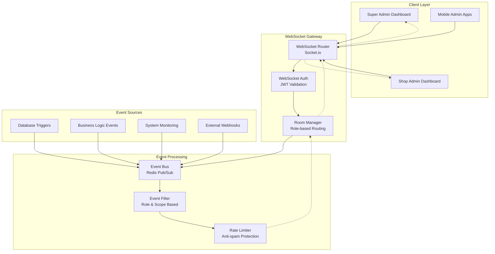

# 에뷰리띵 어드민 실시간 이벤트 명세서
## Admin Real-time Events Specification

**문서 버전**: v1.0
**작성일**: 2025-09-26
**연관 문서**:
- [admin-system-comprehensive-prd.md](./admin-system-comprehensive-prd.md)
- [admin-api-integration-specification.md](./admin-api-integration-specification.md)

---

## 📡 실시간 시스템 개요

에뷰리띵 어드민 시스템의 **실시간 업데이트 및 알림 시스템**은 WebSocket 기반으로 구현되며, 관리자 역할에 따라 차별화된 이벤트를 제공합니다.

### 🏗️ WebSocket 아키텍처



---

## 🔐 인증 및 연결 관리

### 🎯 WebSocket 인증 플로우

```typescript
// WebSocket 연결 인증
interface WebSocketAuth {
  // 연결 시 인증
  connection: {
    url: '/admin-websocket',
    auth: {
      token: string;          // JWT 토큰
      adminRole: 'super_admin' | 'shop_admin';
      shopId?: string;        // shop_admin만 필수
    },
    timeout: 5000,           // 5초 연결 타임아웃
    reconnection: true,      // 자동 재연결
    maxReconnectionAttempts: 5
  };

  // 룸 할당
  roomAssignment: {
    super_admin: 'admin-global',    // 전체 플랫폼 이벤트
    shop_admin: 'shop-{shopId}'     // 특정 샵 이벤트만
  };

  // 권한 검증
  permissionCheck: {
    eventSubscription: '이벤트 구독 권한 확인',
    dataAccess: '데이터 접근 권한 검증',
    actionExecution: '액션 실행 권한 체크'
  };
}

// 클라이언트 연결 코드
const connectAdminWebSocket = () => {
  const socket = io('/admin-websocket', {
    auth: {
      token: localStorage.getItem('adminToken'),
      adminRole: getCurrentAdminRole(),
      shopId: getCurrentShopId() // shop_admin만
    },
    transports: ['websocket'], // WebSocket 우선
    upgrade: true,
    rememberUpgrade: true
  });

  // 연결 성공
  socket.on('connect', () => {
    console.log('Admin WebSocket connected:', socket.id);
  });

  // 인증 실패
  socket.on('auth_error', (error) => {
    console.error('WebSocket auth failed:', error);
    redirectToLogin();
  });

  // 권한 오류
  socket.on('permission_denied', (event) => {
    console.warn('Permission denied for event:', event);
  });

  return socket;
};
```

---

## 🏠 슈퍼 어드민 이벤트 스키마

### 📊 플랫폼 메트릭 이벤트

#### `platform.metrics.updated`
```typescript
interface PlatformMetricsEvent {
  event: 'platform.metrics.updated';
  timestamp: string; // ISO 8601
  data: {
    // 사용자 지표
    users: {
      total: number;
      active: number;        // 지난 30일 활성
      new_today: number;
      growth_rate: number;   // 월간 성장률 (%)
    };

    // 샵 지표
    shops: {
      total: number;
      active: number;
      pending_approval: number;
      featured: number;
    };

    // 예약 지표
    reservations: {
      total_today: number;
      completed_today: number;
      cancelled_today: number;
      revenue_today: number;
    };

    // 시스템 상태
    system: {
      api_response_time: number;    // ms
      error_rate: number;           // %
      database_connections: number;
      redis_memory_usage: number;   // %
    };
  };

  // 변경된 필드만 포함 (성능 최적화)
  changes: string[];              // ['users.total', 'shops.pending_approval']

  // 알림 레벨
  alert_level: 'info' | 'warning' | 'critical';
}

// 프론트엔드 처리 예시
socket.on('platform.metrics.updated', (event: PlatformMetricsEvent) => {
  // 대시보드 메트릭 실시간 업데이트
  queryClient.setQueryData(['dashboard-overview'], (oldData) => ({
    ...oldData,
    ...event.data,
    lastUpdated: event.timestamp
  }));

  // 중요한 변화 시 알림
  if (event.alert_level === 'critical') {
    toast.error(`Critical alert: Check ${event.changes.join(', ')}`);
  }

  // 특정 메트릭 카드 하이라이트
  event.changes.forEach(field => {
    highlightMetricCard(field, 2000); // 2초간 하이라이트
  });
});
```

### 🏪 샵 관리 이벤트

#### `shop.registration.new`
```typescript
interface ShopRegistrationEvent {
  event: 'shop.registration.new';
  timestamp: string;
  data: {
    shop: {
      id: string;
      name: string;
      description: string;
      category: 'nail' | 'eyelash' | 'waxing' | 'eyebrow_tattoo' | 'hair';
      address: string;
      phone_number: string;
      email: string;
    };

    owner: {
      id: string;
      name: string;
      email: string;
      phone_number: string;
      verification_status: 'pending' | 'verified';
    };

    documents: {
      business_license: {
        uploaded: boolean;
        file_url?: string;
        verified: boolean;
      };
      identity_verification: {
        uploaded: boolean;
        verified: boolean;
      };
    };

    // 긴급도 평가
    urgency: {
      level: 'low' | 'medium' | 'high' | 'critical';
      factors: string[];      // ['complete_documents', 'popular_area', 'competitor_nearby']
      auto_score: number;     // 0-100 자동 점수
    };

    // 자동 분석 결과
    analysis: {
      duplicate_check: 'passed' | 'similar_found' | 'duplicate_detected';
      location_analysis: {
        market_saturation: 'low' | 'medium' | 'high';
        competition_count: number;
        demand_estimate: 'low' | 'medium' | 'high';
      };
      risk_assessment: {
        overall_risk: 'low' | 'medium' | 'high';
        risk_factors: string[];
      };
    };
  };

  // 액션 제안
  suggested_actions: Array<{
    action: 'approve' | 'request_documents' | 'schedule_interview' | 'reject';
    priority: number;
    reason: string;
  }>;
}

// 프론트엔드 처리
socket.on('shop.registration.new', (event: ShopRegistrationEvent) => {
  const { shop, urgency, analysis, suggested_actions } = event.data;

  // 알림 표시 (긴급도에 따라 다른 스타일)
  const notificationConfig = {
    low: { type: 'info', duration: 5000 },
    medium: { type: 'warning', duration: 8000 },
    high: { type: 'error', duration: 10000, sound: true },
    critical: { type: 'error', duration: 0, sound: true, popup: true }
  };

  const config = notificationConfig[urgency.level];

  showNotification({
    ...config,
    title: '새로운 샵 등록',
    message: `${shop.name} (${shop.category}) - ${urgency.level.toUpperCase()}`,
    actions: [
      {
        label: '승인 대기열로 이동',
        onClick: () => navigate(`/admin/shops/approval?highlight=${shop.id}`)
      },
      {
        label: '상세 보기',
        onClick: () => openShopDetailModal(shop.id)
      }
    ]
  });

  // 승인 대기열 업데이트
  queryClient.invalidateQueries(['pending-shop-approvals']);

  // 긴급한 경우 자동으로 승인 페이지로 이동 제안
  if (urgency.level === 'critical') {
    showConfirmDialog({
      title: '긴급 샵 등록',
      message: `${shop.name}의 등록이 긴급으로 분류되었습니다. 승인 페이지로 이동하시겠습니까?`,
      onConfirm: () => navigate(`/admin/shops/approval?highlight=${shop.id}&priority=high`)
    });
  }

  // 브라우저 알림 (권한이 있는 경우)
  if (Notification.permission === 'granted' && urgency.level !== 'low') {
    new Notification('새로운 샵 등록', {
      body: `${shop.name} - ${urgency.level} 긴급도`,
      icon: '/shop-registration-icon.png',
      tag: shop.id, // 중복 알림 방지
      requireInteraction: urgency.level === 'critical'
    });
  }
});
```

#### `shop.status.changed`
```typescript
interface ShopStatusChangeEvent {
  event: 'shop.status.changed';
  timestamp: string;
  data: {
    shop_id: string;
    shop_name: string;
    old_status: 'pending_approval' | 'active' | 'inactive' | 'suspended' | 'rejected';
    new_status: 'pending_approval' | 'active' | 'inactive' | 'suspended' | 'rejected';

    changed_by: {
      admin_id: string;
      admin_name: string;
      admin_role: 'super_admin' | 'shop_admin';
    };

    reason?: string;
    notes?: string;

    // 상태 변경에 따른 자동 액션
    automated_actions: Array<{
      action: 'send_notification' | 'update_featured_status' | 'adjust_commission' | 'trigger_review';
      status: 'completed' | 'pending' | 'failed';
      details?: string;
    }>;

    // 영향 받는 데이터
    impact: {
      active_reservations: number;
      affected_customers: number;
      pending_payments: number;
    };
  };
}
```

### 👤 사용자 관리 이벤트

#### `user.registration.new`
```typescript
interface UserRegistrationEvent {
  event: 'user.registration.new';
  timestamp: string;
  data: {
    user: {
      id: string;
      email: string;
      name: string;
      phone_number?: string;
      social_provider: 'kakao' | 'apple' | 'google' | 'naver';
      referral_code?: string;
      referred_by_code?: string;
    };

    // 가입 컨텍스트
    registration_context: {
      source: 'organic' | 'referral' | 'marketing' | 'social_media';
      device_type: 'mobile' | 'tablet' | 'desktop';
      location: {
        country: string;
        region: string;
        city: string;
      };
      utm_params?: Record<string, string>;
    };

    // 자동 분석
    analysis: {
      risk_score: number;        // 0-100 (높을수록 위험)
      risk_factors: string[];    // ['multiple_accounts_same_ip', 'suspicious_email_pattern']
      profile_completeness: number; // 0-100
      verification_status: {
        email: 'verified' | 'pending' | 'failed';
        phone: 'verified' | 'pending' | 'not_provided';
      };
    };

    // 추천인 정보 (있는 경우)
    referral_info?: {
      referrer_id: string;
      referrer_name: string;
      referrer_type: 'user' | 'influencer' | 'shop_owner';
      points_awarded: number;
    };
  };
}

// 프론트엔드 처리
socket.on('user.registration.new', (event: UserRegistrationEvent) => {
  const { user, analysis, referral_info } = event.data;

  // 위험 점수에 따른 처리
  if (analysis.risk_score > 80) {
    showHighRiskUserAlert(user, analysis.risk_factors);
  }

  // 추천인 시스템 처리
  if (referral_info && referral_info.referrer_type === 'influencer') {
    showInfluencerReferralNotification(referral_info);
  }

  // 통계 업데이트
  queryClient.invalidateQueries(['dashboard-overview']);
  queryClient.invalidateQueries(['user-registrations']);

  // 일일 등록 목표 달성 체크
  checkDailyRegistrationGoal();
});
```

#### `user.status.critical`
```typescript
interface UserCriticalEvent {
  event: 'user.status.critical';
  timestamp: string;
  priority: 'high' | 'critical';
  data: {
    user: {
      id: string;
      name: string;
      email: string;
      phone_number?: string;
      current_status: 'active' | 'suspended' | 'banned';
    };

    incident: {
      type: 'payment_fraud' | 'multiple_account_abuse' | 'review_manipulation' | 'terms_violation' | 'chargebacks';
      severity: 'medium' | 'high' | 'critical';
      description: string;
      evidence: Array<{
        type: 'screenshot' | 'transaction' | 'log_entry' | 'report';
        url?: string;
        content?: string;
        timestamp: string;
      }>;
    };

    // 자동 분석 결과
    automated_analysis: {
      confidence_score: number;    // 0-100
      similar_incidents: number;   // 유사한 사건 수
      pattern_match: string[];     // 매칭된 패턴들
      recommended_action: 'investigate' | 'suspend' | 'ban' | 'manual_review';
    };

    // 영향 범위
    impact_assessment: {
      affected_shops: number;
      disputed_transactions: number;
      potential_loss: number;      // 금액 (KRW)
      affected_customers: number;
    };

    // 긴급 액션 제안
    urgent_actions: Array<{
      action: 'freeze_account' | 'suspend_payments' | 'flag_transactions' | 'notify_legal';
      urgency: 'immediate' | 'within_1h' | 'within_24h';
      description: string;
    }>;
  };
}
```

### 💳 결제 시스템 이벤트

#### `payment.failure.critical`
```typescript
interface PaymentFailureEvent {
  event: 'payment.failure.critical';
  timestamp: string;
  severity: 'warning' | 'error' | 'critical';
  data: {
    payment: {
      id: string;
      amount: number;
      currency: 'KRW';
      method: 'card' | 'kakao_pay' | 'naver_pay' | 'toss' | 'bank_transfer';
      external_payment_id?: string;
    };

    transaction: {
      reservation_id: string;
      user_id: string;
      shop_id: string;
      service_name: string;
      scheduled_at: string;
    };

    failure: {
      error_code: string;
      error_message: string;
      provider_response?: string;
      retry_count: number;
      last_retry_at?: string;
    };

    // 영향 분석
    impact: {
      customer_experience: 'low' | 'medium' | 'high';
      business_impact: number;      // 예상 손실 (KRW)
      reputation_risk: 'low' | 'medium' | 'high';
      urgency_score: number;        // 0-100
    };

    // 자동 복구 시도
    recovery_attempts: Array<{
      method: 'retry_payment' | 'alternative_method' | 'manual_process';
      status: 'attempted' | 'succeeded' | 'failed';
      timestamp: string;
      result?: string;
    }>;

    // 고객 커뮤니케이션
    customer_notification: {
      sent: boolean;
      method: 'sms' | 'email' | 'push' | 'in_app';
      status: 'delivered' | 'failed' | 'pending';
    };
  };
}

// 프론트엔드 처리
socket.on('payment.failure.critical', (event: PaymentFailureEvent) => {
  const { payment, failure, impact, recovery_attempts } = event.data;

  // 심각도에 따른 알림
  const alertType = {
    warning: 'warning',
    error: 'error',
    critical: 'error'
  }[event.severity];

  showNotification({
    type: alertType,
    title: '결제 실패 알림',
    message: `${payment.amount.toLocaleString()}원 결제 실패 - ${failure.error_code}`,
    persistent: event.severity === 'critical',
    actions: [
      {
        label: '상세 보기',
        onClick: () => openPaymentDetailModal(payment.id)
      },
      {
        label: '고객 지원',
        onClick: () => initiateCustomerSupport(event.data.transaction.user_id)
      }
    ]
  });

  // 크리티컬한 경우 즉시 대응 팀에 알림
  if (event.severity === 'critical') {
    sendEmergencyAlert({
      type: 'payment_system_failure',
      data: event.data,
      recipients: ['payment_team', 'customer_support', 'management']
    });
  }

  // 결제 대시보드 업데이트
  queryClient.invalidateQueries(['payment-overview']);
  queryClient.invalidateQueries(['payment-failures']);

  // 연속 실패 패턴 감지
  if (failure.retry_count > 3) {
    checkPaymentSystemHealth();
  }
});
```

---

## 🏪 샵 어드민 이벤트 스키마

### 📅 예약 관리 이벤트

#### `reservation.created`
```typescript
interface ReservationCreatedEvent {
  event: 'reservation.created';
  timestamp: string;
  shop_id: string; // 자동으로 필터링됨
  data: {
    reservation: {
      id: string;
      customer: {
        id: string;
        name: string;
        phone_number: string;
        email?: string;
        is_new_customer: boolean;
        previous_visits: number;
      };

      service: {
        id: string;
        name: string;
        duration: number;     // 분
        price: number;
        category: string;
      };

      schedule: {
        date: string;         // YYYY-MM-DD
        time: string;         // HH:MM
        timezone: 'Asia/Seoul';
        staff_id?: string;
        staff_name?: string;
      };

      booking_details: {
        total_amount: number;
        deposit_amount?: number;
        payment_method?: string;
        special_requests?: string;
        source: 'app' | 'web' | 'phone' | 'walk_in';
      };
    };

    // 예약 분석
    analysis: {
      time_slot_popularity: 'low' | 'medium' | 'high';
      customer_loyalty_score: number;  // 0-100
      estimated_preparation_time: number; // 분
      conflict_check: {
        has_conflicts: boolean;
        overlapping_reservations: string[];
      };
    };

    // 자동 액션
    automated_actions: Array<{
      action: 'send_confirmation' | 'block_time_slot' | 'prepare_materials' | 'update_schedule';
      status: 'completed' | 'pending' | 'failed';
      details?: string;
    }>;

    // 추천 액션
    recommended_actions: Array<{
      action: 'contact_customer' | 'prepare_service' | 'check_inventory' | 'assign_staff';
      priority: 'low' | 'medium' | 'high';
      deadline?: string; // ISO timestamp
      description: string;
    }>;
  };
}

// 샵 어드민 프론트엔드 처리
socket.on('reservation.created', (event: ReservationCreatedEvent) => {
  const { reservation, analysis, recommended_actions } = event.data;

  // 즉시 알림 표시
  showNotification({
    type: 'success',
    title: '새로운 예약',
    message: `${reservation.customer.name} - ${reservation.service.name}`,
    duration: 8000,
    actions: [
      {
        label: '확인',
        onClick: () => openReservationDetail(reservation.id)
      },
      {
        label: '고객 연락',
        onClick: () => initiateCustomerCall(reservation.customer.phone_number)
      }
    ]
  });

  // 예약 캘린더 실시간 업데이트
  queryClient.invalidateQueries(['shop-reservations']);
  queryClient.setQueryData(['shop-reservations'], (oldData) => {
    // 새 예약을 기존 데이터에 추가
    return addReservationToCalendar(oldData, reservation);
  });

  // 대시보드 통계 업데이트
  queryClient.invalidateQueries(['shop-dashboard']);

  // 신규 고객인 경우 특별 처리
  if (reservation.customer.is_new_customer) {
    showWelcomeNewCustomerModal(reservation);
  }

  // 충돌 감지 시 경고
  if (analysis.conflict_check.has_conflicts) {
    showConflictWarning({
      reservationId: reservation.id,
      conflicts: analysis.conflict_check.overlapping_reservations,
      suggestedActions: ['reschedule', 'assign_different_staff', 'extend_time_slot']
    });
  }

  // 추천 액션 처리
  if (recommended_actions.length > 0) {
    showRecommendedActionsPanel(recommended_actions, reservation.id);
  }

  // 브라우저 알림 (모바일 앱에서 유용)
  if (Notification.permission === 'granted') {
    new Notification('새로운 예약 접수', {
      body: `${reservation.customer.name} - ${format(new Date(reservation.schedule.date + ' ' + reservation.schedule.time), 'MM/dd HH:mm')}`,
      icon: '/reservation-icon.png',
      tag: reservation.id,
      data: { reservationId: reservation.id }
    });
  }
});
```

#### `reservation.cancelled`
```typescript
interface ReservationCancelledEvent {
  event: 'reservation.cancelled';
  timestamp: string;
  shop_id: string;
  data: {
    reservation: {
      id: string;
      customer: {
        id: string;
        name: string;
        phone_number: string;
      };
      service: {
        name: string;
        price: number;
      };
      original_schedule: {
        date: string;
        time: string;
        staff_name?: string;
      };
    };

    cancellation: {
      cancelled_by: 'customer' | 'shop' | 'system';
      reason: string;
      cancellation_time: string;
      notice_hours: number;      // 몇 시간 전 취소인지
      policy_compliance: {
        within_policy: boolean;
        penalty_applicable: boolean;
        refund_amount: number;
      };
    };

    // 비즈니스 영향
    impact: {
      revenue_loss: number;
      time_slot_utilization: 'can_rebook' | 'too_late' | 'partial_rebooking';
      customer_relationship: 'positive' | 'neutral' | 'negative';
      staff_schedule_impact: 'none' | 'minor' | 'major';
    };

    // 자동 처리 사항
    automated_processing: {
      refund_initiated: boolean;
      time_slot_released: boolean;
      customer_notification_sent: boolean;
      staff_notification_sent: boolean;
    };

    // 추천 대응
    recommended_response: Array<{
      action: 'contact_customer' | 'offer_rescheduling' | 'apply_penalty' | 'release_slot' | 'offer_discount';
      urgency: 'immediate' | 'within_2h' | 'within_24h';
      description: string;
    }>;
  };
}

// 처리 로직
socket.on('reservation.cancelled', (event: ReservationCancelledEvent) => {
  const { reservation, cancellation, impact, recommended_response } = event.data;

  // 취소 알림 표시
  const notificationType = impact.customer_relationship === 'negative' ? 'warning' : 'info';
  showNotification({
    type: notificationType,
    title: '예약 취소',
    message: `${reservation.customer.name} - ${reservation.service.name} (${cancellation.notice_hours}시간 전)`,
    duration: 10000,
    actions: [
      {
        label: '상세 보기',
        onClick: () => openCancellationDetail(reservation.id)
      },
      {
        label: '고객 연락',
        onClick: () => initiateCustomerCall(reservation.customer.phone_number)
      }
    ]
  });

  // 예약 캘린더에서 제거
  queryClient.setQueryData(['shop-reservations'], (oldData) => {
    return removeReservationFromCalendar(oldData, reservation.id);
  });

  // 빈 시간대 자동 마케팅 제안
  if (impact.time_slot_utilization === 'can_rebook') {
    suggestLastMinuteBooking({
      date: reservation.original_schedule.date,
      time: reservation.original_schedule.time,
      service: reservation.service.name
    });
  }

  // 고객 관계 관리
  if (impact.customer_relationship === 'negative') {
    addToCustomerRetentionCampaign(reservation.customer.id, 'cancellation_recovery');
  }

  // 대시보드 업데이트
  queryClient.invalidateQueries(['shop-dashboard']);
  queryClient.invalidateQueries(['cancellation-analytics']);
});
```

### 💬 고객 소통 이벤트

#### `customer.message.received`
```typescript
interface CustomerMessageEvent {
  event: 'customer.message.received';
  timestamp: string;
  shop_id: string;
  data: {
    message: {
      id: string;
      customer: {
        id: string;
        name: string;
        phone_number?: string;
        email?: string;
        customer_tier: 'new' | 'regular' | 'vip' | 'inactive';
      };

      content: {
        text: string;
        images?: Array<{
          url: string;
          thumbnail_url: string;
        }>;
        attachments?: Array<{
          type: 'image' | 'document';
          url: string;
          filename: string;
        }>;
      };

      context: {
        channel: 'kakao_talk' | 'sms' | 'email' | 'in_app' | 'phone';
        related_reservation_id?: string;
        conversation_thread_id: string;
        is_first_message: boolean;
        response_expected: boolean;
      };
    };

    // 메시지 분석
    analysis: {
      sentiment: 'positive' | 'neutral' | 'negative' | 'frustrated';
      urgency: 'low' | 'medium' | 'high' | 'critical';
      category: 'inquiry' | 'complaint' | 'compliment' | 'booking' | 'cancellation' | 'rescheduling';
      keywords: string[];

      // AI 자동 분류
      intent_classification: {
        primary_intent: string;
        confidence_score: number; // 0-100
        requires_human_response: boolean;
        suggested_response_template?: string;
      };
    };

    // 고객 히스토리 요약
    customer_context: {
      total_visits: number;
      last_visit: string;
      average_rating: number;
      total_spent: number;
      previous_complaints: number;
      loyalty_score: number; // 0-100
    };

    // 응답 제안
    response_suggestions: Array<{
      type: 'quick_reply' | 'template' | 'action_required';
      text?: string;
      action?: 'schedule_call' | 'offer_discount' | 'escalate_to_manager';
      priority: number;
    }>;

    // SLA 정보
    sla: {
      target_response_time: number; // 분
      deadline: string; // ISO timestamp
      escalation_time: number; // 분
    };
  };
}

// 메시지 처리 로직
socket.on('customer.message.received', (event: CustomerMessageEvent) => {
  const { message, analysis, customer_context, response_suggestions, sla } = event.data;

  // 긴급도와 감정에 따른 알림 설정
  const urgencyConfig = {
    low: { type: 'info', sound: false, duration: 5000 },
    medium: { type: 'warning', sound: true, duration: 8000 },
    high: { type: 'error', sound: true, duration: 0 }, // 수동으로 닫기
    critical: { type: 'error', sound: true, duration: 0, popup: true }
  };

  const config = urgencyConfig[analysis.urgency];

  // 고객 등급에 따른 우선순위 조정
  if (message.customer.customer_tier === 'vip') {
    config.priority = 'high';
    config.duration = 0; // VIP는 항상 수동으로 닫기
  }

  showNotification({
    ...config,
    title: `${message.customer.name}님 메시지 ${analysis.urgency === 'critical' ? '(긴급)' : ''}`,
    message: message.content.text.substring(0, 50) + (message.content.text.length > 50 ? '...' : ''),
    actions: [
      {
        label: '답변하기',
        onClick: () => openMessageComposer(message.id, response_suggestions)
      },
      {
        label: '고객 정보',
        onClick: () => openCustomerProfile(message.customer.id)
      }
    ]
  });

  // 메시지 리스트 업데이트
  queryClient.invalidateQueries(['customer-messages']);
  queryClient.setQueryData(['unread-messages'], (old: number = 0) => old + 1);

  // 감정 분석이 부정적인 경우 특별 처리
  if (analysis.sentiment === 'frustrated' || analysis.sentiment === 'negative') {
    showCustomerRetentionAlert({
      customerId: message.customer.id,
      customerName: message.customer.name,
      issue: analysis.category,
      loyaltyScore: customer_context.loyalty_score,
      suggestions: [
        'immediate_response',
        'manager_escalation',
        'compensation_offer'
      ]
    });
  }

  // 응답 시간 추적 시작
  startResponseTimer(message.id, sla.deadline);

  // VIP 고객 또는 긴급 메시지의 경우 브라우저 알림
  if (message.customer.customer_tier === 'vip' || analysis.urgency === 'critical') {
    if (Notification.permission === 'granted') {
      new Notification(`${message.customer.customer_tier.toUpperCase()} 고객 메시지`, {
        body: `${message.customer.name}: ${message.content.text.substring(0, 100)}`,
        icon: '/vip-customer-icon.png',
        requireInteraction: true,
        tag: message.id
      });
    }
  }

  // 자동 응답 가능한 경우 제안
  if (analysis.intent_classification.confidence_score > 80 &&
      analysis.intent_classification.suggested_response_template) {
    showAutoResponseSuggestion({
      messageId: message.id,
      template: analysis.intent_classification.suggested_response_template,
      confidence: analysis.intent_classification.confidence_score
    });
  }
});
```

---

## 🔧 이벤트 필터링 및 라우팅

### 🎯 역할 기반 이벤트 필터링

```typescript
// 서버사이드 이벤트 필터링 로직
class AdminEventFilter {
  // 슈퍼 어드민 이벤트 필터
  private filterSuperAdminEvents(event: AdminEvent, adminInfo: AdminInfo): boolean {
    // 슈퍼 어드민은 모든 이벤트 수신 가능
    if (adminInfo.role === 'super_admin') {
      return true;
    }

    return false;
  }

  // 샵 어드민 이벤트 필터
  private filterShopAdminEvents(event: AdminEvent, adminInfo: AdminInfo): boolean {
    if (adminInfo.role !== 'shop_admin') {
      return false;
    }

    // 샵 ID가 있는 이벤트만 필터링
    if (!event.shop_id || event.shop_id !== adminInfo.shop_id) {
      return false;
    }

    // 허용된 이벤트 타입 체크
    const allowedEvents = [
      'reservation.created',
      'reservation.cancelled',
      'reservation.rescheduled',
      'customer.message.received',
      'review.posted',
      'payment.completed',
      'payment.failed',
      'shop.settings.updated'
    ];

    return allowedEvents.includes(event.event);
  }

  // 메인 필터링 메서드
  public shouldReceiveEvent(event: AdminEvent, adminInfo: AdminInfo): boolean {
    // 기본 검증
    if (!this.validateEventStructure(event)) {
      return false;
    }

    // 역할별 필터링
    switch (adminInfo.role) {
      case 'super_admin':
        return this.filterSuperAdminEvents(event, adminInfo);

      case 'shop_admin':
        return this.filterShopAdminEvents(event, adminInfo);

      default:
        return false;
    }
  }

  // 개인정보 필터링
  public sanitizeEventForRecipient(event: AdminEvent, adminInfo: AdminInfo): AdminEvent {
    const sanitized = { ...event };

    // 샵 어드민의 경우 고객 개인정보 마스킹
    if (adminInfo.role === 'shop_admin') {
      if (sanitized.data?.customer?.email) {
        sanitized.data.customer.email = this.maskEmail(sanitized.data.customer.email);
      }

      if (sanitized.data?.customer?.phone_number) {
        sanitized.data.customer.phone_number = this.maskPhoneNumber(sanitized.data.customer.phone_number);
      }
    }

    return sanitized;
  }

  private maskEmail(email: string): string {
    const [username, domain] = email.split('@');
    const maskedUsername = username.substring(0, 2) + '*'.repeat(username.length - 2);
    return `${maskedUsername}@${domain}`;
  }

  private maskPhoneNumber(phone: string): string {
    return phone.replace(/(\d{3})-(\d{4})-(\d{4})/, '$1-****-$3');
  }
}
```

### 🔄 이벤트 레이트 리미팅

```typescript
// 이벤트 레이트 리미터
class AdminEventRateLimiter {
  private static readonly LIMITS = {
    super_admin: {
      'platform.metrics.updated': { max: 60, window: 60000 }, // 1분에 60개
      'shop.registration.new': { max: 100, window: 60000 },
      'user.registration.new': { max: 200, window: 60000 }
    },
    shop_admin: {
      'reservation.created': { max: 50, window: 60000 },      // 1분에 50개
      'customer.message.received': { max: 30, window: 60000 }, // 1분에 30개
      'payment.completed': { max: 100, window: 60000 }
    }
  };

  public shouldThrottleEvent(
    eventType: string,
    adminRole: 'super_admin' | 'shop_admin',
    adminId: string
  ): boolean {
    const limits = AdminEventRateLimiter.LIMITS[adminRole];
    const eventLimit = limits[eventType];

    if (!eventLimit) {
      return false; // 제한이 없는 이벤트는 통과
    }

    const key = `rate_limit:${adminRole}:${adminId}:${eventType}`;
    const currentCount = this.redis.incr(key);

    if (currentCount === 1) {
      this.redis.expire(key, Math.ceil(eventLimit.window / 1000));
    }

    return currentCount > eventLimit.max;
  }

  // 이벤트 배칭 (성능 최적화)
  public batchEvents(events: AdminEvent[], maxBatchSize: number = 10): AdminEvent[][] {
    const batches: AdminEvent[][] = [];

    for (let i = 0; i < events.length; i += maxBatchSize) {
      batches.push(events.slice(i, i + maxBatchSize));
    }

    return batches;
  }
}
```

---

## 📱 모바일 최적화 이벤트 처리

### 🔋 배터리 효율성을 위한 이벤트 압축

```typescript
// 모바일용 이벤트 압축
interface CompressedEvent {
  // 필수 정보만 포함한 경량화 버전
  t: string;          // timestamp (압축)
  e: string;          // event type (압축)
  d: any;            // data (압축)
  p: 'low' | 'medium' | 'high' | 'critical'; // priority
}

class MobileEventOptimizer {
  // 이벤트 압축
  public compressEvent(event: AdminEvent): CompressedEvent {
    return {
      t: event.timestamp,
      e: this.compressEventType(event.event),
      d: this.compressEventData(event.data, event.event),
      p: this.calculatePriority(event)
    };
  }

  // 이벤트 타입 압축
  private compressEventType(eventType: string): string {
    const typeMap: Record<string, string> = {
      'platform.metrics.updated': 'pm.up',
      'shop.registration.new': 'sh.new',
      'reservation.created': 'rs.cr',
      'reservation.cancelled': 'rs.cn',
      'customer.message.received': 'cm.rc',
      'payment.completed': 'py.ok',
      'payment.failed': 'py.fl'
    };

    return typeMap[eventType] || eventType;
  }

  // 우선순위 계산
  private calculatePriority(event: AdminEvent): 'low' | 'medium' | 'high' | 'critical' {
    // 이벤트 타입별 기본 우선순위
    const basePriority: Record<string, string> = {
      'user.status.critical': 'critical',
      'payment.failure.critical': 'critical',
      'reservation.created': 'high',
      'customer.message.received': 'medium',
      'platform.metrics.updated': 'low'
    };

    let priority = basePriority[event.event] || 'medium';

    // 데이터 기반 우선순위 조정
    if (event.data?.urgency === 'critical' || event.data?.severity === 'critical') {
      priority = 'critical';
    } else if (event.data?.customer?.customer_tier === 'vip') {
      priority = 'high';
    }

    return priority as any;
  }

  // 백그라운드 상태에서의 이벤트 처리
  public handleBackgroundEvent(event: CompressedEvent): void {
    // 크리티컬한 이벤트만 즉시 처리
    if (event.p === 'critical') {
      this.sendPushNotification(event);
    } else {
      // 나머지는 큐에 저장 후 앱 활성화 시 일괄 처리
      this.queueEventForLaterProcessing(event);
    }
  }

  // 배치 처리로 배터리 최적화
  public processBatchedEvents(events: CompressedEvent[]): void {
    const grouped = this.groupEventsByType(events);

    // 같은 타입의 이벤트들을 합쳐서 처리
    Object.entries(grouped).forEach(([type, eventList]) => {
      this.processGroupedEvents(type, eventList);
    });
  }
}
```

---

## 🎯 결론 및 구현 가이드

### ✅ 실시간 시스템 구현 체크리스트

#### 🚀 Phase 1: 기본 WebSocket 연결
```markdown
- [ ] Socket.io 서버 설정 및 인증 미들웨어
- [ ] 클라이언트 연결 관리 및 룸 기반 라우팅
- [ ] 기본 이벤트 (platform.metrics.updated, shop.registration.new)
- [ ] 슈퍼 어드민 대시보드 실시간 업데이트
```

#### 🏪 Phase 2: 샵 어드민 실시간 기능
```markdown
- [ ] 샵별 이벤트 필터링 및 스코핑
- [ ] 예약 관련 실시간 이벤트 (created, cancelled)
- [ ] 고객 메시지 실시간 수신
- [ ] 샵 어드민 대시보드 실시간 업데이트
```

#### 📱 Phase 3: 모바일 최적화
```markdown
- [ ] 이벤트 압축 및 배치 처리
- [ ] 백그라운드 상태 처리
- [ ] 푸시 알림 통합
- [ ] 배터리 효율성 최적화
```

### 🔧 기술적 고려사항

#### 성능 최적화
- **이벤트 배칭**: 유사한 이벤트들을 묶어서 전송
- **압축**: JSON 압축 및 필드 단축화
- **선택적 구독**: 필요한 이벤트만 구독
- **캐싱**: 자주 사용되는 데이터 Redis 캐싱

#### 안정성 확보
- **자동 재연결**: 네트워크 끊김 시 자동 복구
- **이벤트 순서**: 타임스탬프 기반 순서 보장
- **중복 방지**: 이벤트 ID 기반 중복 제거
- **백프레셔**: 클라이언트 처리 능력에 따른 속도 조절

### 🎉 실시간 시스템의 비즈니스 가치

**⚡ 즉시성**: 중요한 이벤트에 대한 실시간 대응
**🎯 효율성**: 자동화된 알림으로 관리 효율성 향상
**🏆 경쟁력**: 빠른 고객 응대로 서비스 품질 개선
**📈 성장**: 실시간 데이터 기반 의사결정 지원

**에뷰리띵의 실시간 관리 시스템으로 한국 뷰티 플랫폼의 새로운 기준을 만들어갑니다!** 🚀💄✨