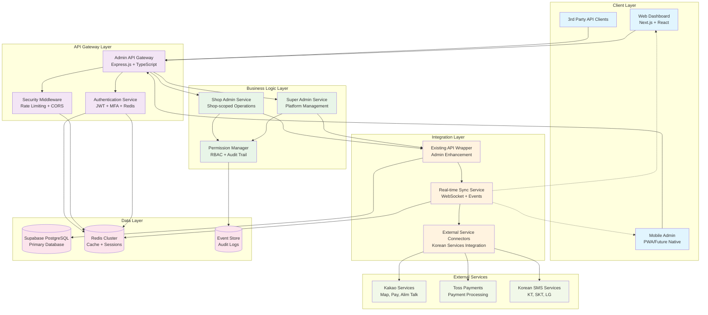
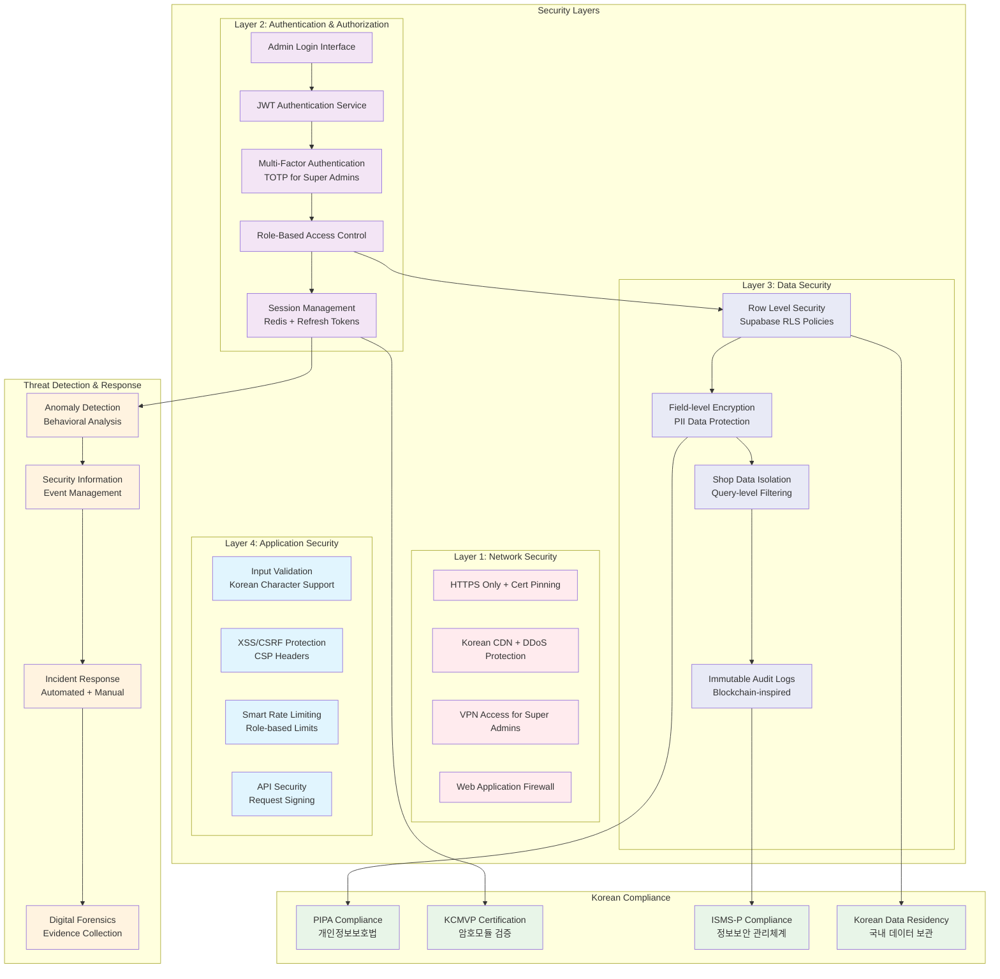
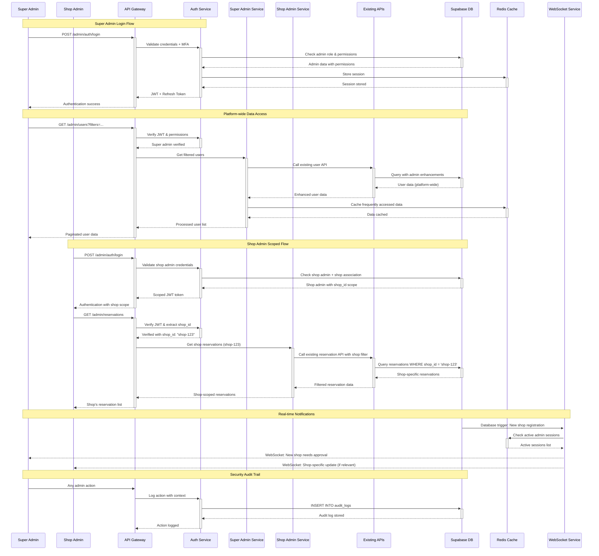
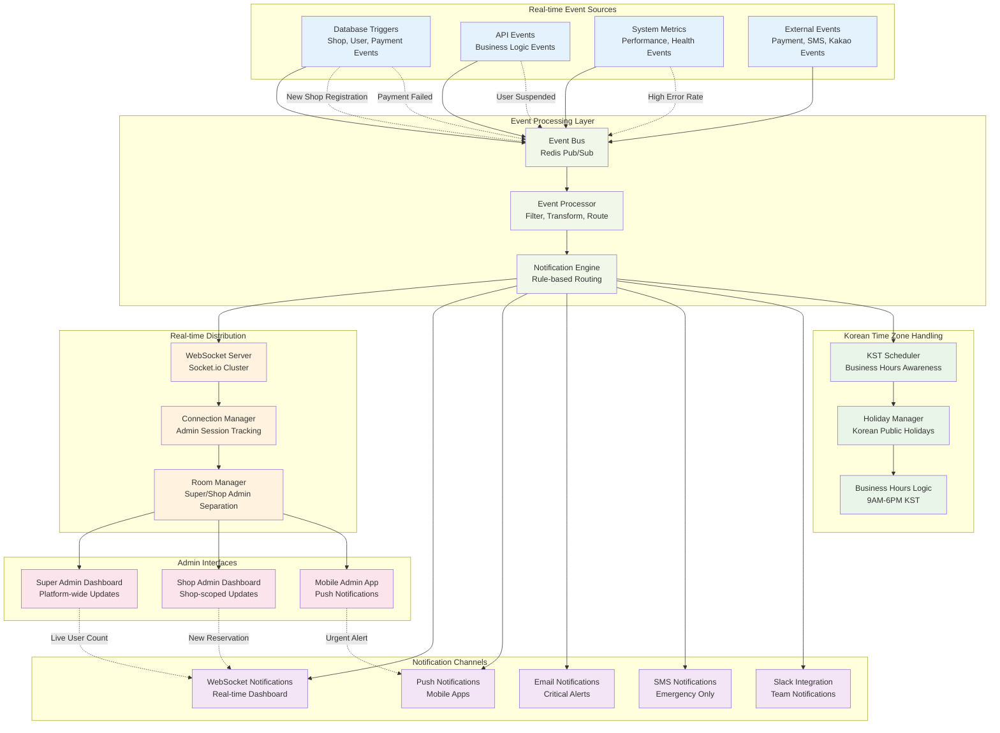
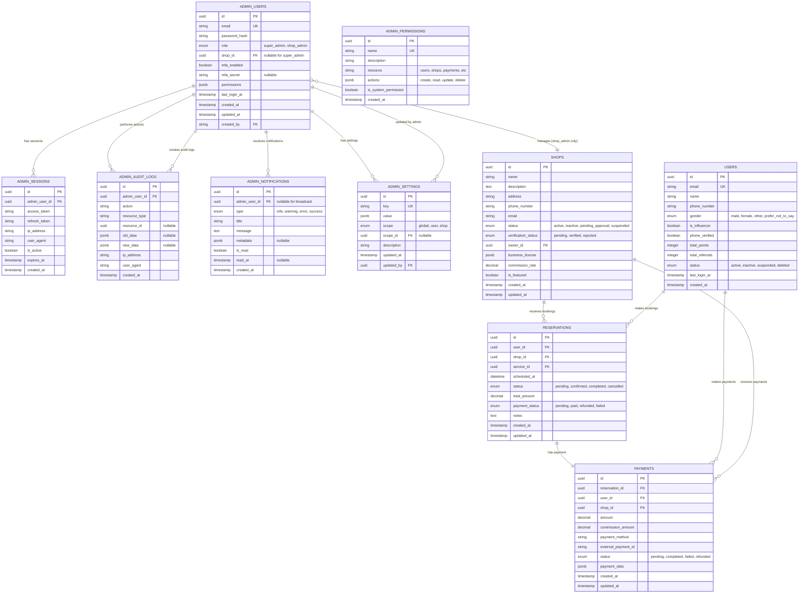

# 에뷰리띵 어드민 시스템 아키텍처 다이어그램
## Admin System Architecture Diagrams

**문서 버전**: v1.0
**작성일**: 2025-09-26
**연관 문서**: [admin-system-comprehensive-prd.md](./admin-system-comprehensive-prd.md)

---

## 🏗️ 시스템 전체 아키텍처 다이어그램



---

## 🔐 보안 아키텍처 다이어그램



---

## 📊 데이터 플로우 다이어그램



---

## 🌐 실시간 시스템 아키텍처



---

## 📱 사용자 인터페이스 아키텍처

```mermaid
graph TD
    subgraph "Design System"
        THEME[Korean Design Theme<br/>Colors, Typography, Spacing]
        COMPONENTS[Component Library<br/>Reusable UI Components]
        ICONS[Icon System<br/>Korean-friendly Icons]
        RESPONSIVE[Responsive Grid<br/>Mobile-first Design]
    end

    subgraph "Super Admin Interface"
        SA_DASHBOARD[Dashboard<br/>Platform Overview]
        SA_USER_MGMT[User Management<br/>Search, Filter, Actions]
        SA_SHOP_APPROVAL[Shop Approval<br/>Review, Verify, Approve]
        SA_ANALYTICS[Analytics<br/>Business Intelligence]
        SA_SYSTEM[System Management<br/>Settings, Monitoring]
    end

    subgraph "Shop Admin Interface"
        SHA_DASHBOARD[Shop Dashboard<br/>Shop Overview]
        SHA_RESERVATIONS[Reservations<br/>Calendar, Status Updates]
        SHA_CUSTOMERS[Customer Management<br/>Communication, History]
        SHA_SERVICES[Service Management<br/>Menu, Pricing, Photos]
        SHA_PROFILE[Shop Profile<br/>Info, Hours, Staff]
    end

    subgraph "Common Components"
        NAVIGATION[Navigation System<br/>Role-based Menu]
        NOTIFICATIONS[Notification Center<br/>Real-time Alerts]
        SEARCH[Global Search<br/>Smart Suggestions]
        HELP[Help System<br/>Contextual Assistance]
    end

    subgraph "State Management"
        GLOBAL_STATE[Global State<br/>Redux Toolkit]
        AUTH_STATE[Auth State<br/>User, Permissions, Session]
        UI_STATE[UI State<br/>Modals, Loading, Errors]
        CACHE_STATE[Cache State<br/>React Query]
    end

    subgraph "API Integration"
        API_CLIENT[API Client<br/>Axios + Interceptors]
        REALTIME_CLIENT[WebSocket Client<br/>Socket.io]
        ERROR_BOUNDARY[Error Boundaries<br/>Graceful Degradation]
        LOADING_STATES[Loading States<br/>Skeleton UI]
    end

    subgraph "Korean Localization"
        I18N[Internationalization<br/>Korean Language Support]
        DATE_FORMAT[Date Formatting<br/>Korean Date/Time Format]
        NUMBER_FORMAT[Number Formatting<br/>Korean Number/Currency]
        ADDRESS_FORMAT[Address Formatting<br/>Korean Address System]
    end

    %% Design System Connections
    THEME --> SA_DASHBOARD
    THEME --> SHA_DASHBOARD
    COMPONENTS --> SA_USER_MGMT
    COMPONENTS --> SHA_RESERVATIONS
    RESPONSIVE --> SHA_DASHBOARD
    RESPONSIVE --> SA_DASHBOARD

    %% Common Components
    NAVIGATION --> SA_DASHBOARD
    NAVIGATION --> SHA_DASHBOARD
    NOTIFICATIONS --> SA_DASHBOARD
    NOTIFICATIONS --> SHA_DASHBOARD

    %% State Management
    GLOBAL_STATE --> AUTH_STATE
    AUTH_STATE --> SA_DASHBOARD
    AUTH_STATE --> SHA_DASHBOARD
    UI_STATE --> SA_USER_MGMT
    UI_STATE --> SHA_RESERVATIONS

    %% API Integration
    API_CLIENT --> CACHE_STATE
    REALTIME_CLIENT --> NOTIFICATIONS
    ERROR_BOUNDARY --> SA_DASHBOARD
    ERROR_BOUNDARY --> SHA_DASHBOARD

    %% Korean Localization
    I18N --> SA_DASHBOARD
    I18N --> SHA_DASHBOARD
    DATE_FORMAT --> SA_ANALYTICS
    DATE_FORMAT --> SHA_RESERVATIONS
    ADDRESS_FORMAT --> SA_SHOP_APPROVAL
    ADDRESS_FORMAT --> SHA_PROFILE

    %% Styling
    classDef design fill:#e8eaf6
    classDef super fill:#e3f2fd
    classDef shop fill:#e8f5e8
    classDef common fill:#fff3e0
    classDef state fill:#fce4ec
    classDef api fill:#f3e5f5
    classDef korean fill:#f1f8e9

    class THEME,COMPONENTS,ICONS,RESPONSIVE design
    class SA_DASHBOARD,SA_USER_MGMT,SA_SHOP_APPROVAL,SA_ANALYTICS,SA_SYSTEM super
    class SHA_DASHBOARD,SHA_RESERVATIONS,SHA_CUSTOMERS,SHA_SERVICES,SHA_PROFILE shop
    class NAVIGATION,NOTIFICATIONS,SEARCH,HELP common
    class GLOBAL_STATE,AUTH_STATE,UI_STATE,CACHE_STATE state
    class API_CLIENT,REALTIME_CLIENT,ERROR_BOUNDARY,LOADING_STATES api
    class I18N,DATE_FORMAT,NUMBER_FORMAT,ADDRESS_FORMAT korean
```



---

## 🔄 배포 및 인프라 아키텍처

```mermaid
graph TB
    subgraph "Development Environment"
        DEV_FRONTEND[Frontend Dev Server<br/>Vite + HMR]
        DEV_BACKEND[Backend Dev Server<br/>Nodemon + TypeScript]
        DEV_DB[Development Database<br/>Local Supabase]
        DEV_REDIS[Development Redis<br/>Docker Container]
    end

    subgraph "CI/CD Pipeline"
        GITHUB[GitHub Repository<br/>Source Control]
        GITHUB_ACTIONS[GitHub Actions<br/>Automated Pipeline]
        TESTING[Testing Suite<br/>Unit + Integration + E2E]
        SECURITY_SCAN[Security Scanning<br/>SAST + DAST + Dependency]
        BUILD[Build Process<br/>TypeScript + Bundling]
    end

    subgraph "Staging Environment"
        STAGE_FRONTEND[Staging Frontend<br/>Vercel Preview]
        STAGE_BACKEND[Staging Backend<br/>Supabase Edge Functions]
        STAGE_DB[Staging Database<br/>Supabase Staging]
        STAGE_REDIS[Staging Redis<br/>Redis Cloud]
    end

    subgraph "Production Environment"
        subgraph "Korean Infrastructure"
            PROD_CDN[Korean CDN<br/>CloudFlare Seoul]
            PROD_FRONTEND[Production Frontend<br/>Vercel Pro (Seoul)]
            PROD_BACKEND[Production Backend<br/>Supabase Production]
            PROD_DB[Production Database<br/>PostgreSQL (Seoul Region)]
            PROD_REDIS[Production Redis<br/>Redis Cluster (Seoul)]
        end
    end

    subgraph "Monitoring & Logging"
        APM[Application Performance<br/>Monitoring (Sentry)]
        LOGS[Centralized Logging<br/>Winston + DataDog]
        METRICS[Business Metrics<br/>Custom Dashboard]
        ALERTS[Alerting System<br/>PagerDuty + Slack]
    end

    subgraph "Security & Compliance"
        SSL_CERT[SSL Certificates<br/>Let's Encrypt + CloudFlare]
        FIREWALL[Web Application Firewall<br/>CloudFlare Security]
        BACKUP[Automated Backups<br/>Daily DB + Redis Snapshots]
        COMPLIANCE[Korean Compliance<br/>PIPA + ISMS-P]
    end

    %% Development Flow
    DEV_FRONTEND --> GITHUB
    DEV_BACKEND --> GITHUB
    GITHUB --> GITHUB_ACTIONS
    GITHUB_ACTIONS --> TESTING
    TESTING --> SECURITY_SCAN
    SECURITY_SCAN --> BUILD

    %% Deployment Flow
    BUILD --> STAGE_FRONTEND
    BUILD --> STAGE_BACKEND
    STAGE_FRONTEND --> PROD_FRONTEND
    STAGE_BACKEND --> PROD_BACKEND

    %% Infrastructure Connections
    PROD_CDN --> PROD_FRONTEND
    PROD_FRONTEND --> PROD_BACKEND
    PROD_BACKEND --> PROD_DB
    PROD_BACKEND --> PROD_REDIS

    %% Monitoring Connections
    PROD_FRONTEND --> APM
    PROD_BACKEND --> LOGS
    PROD_DB --> METRICS
    METRICS --> ALERTS

    %% Security Connections
    PROD_CDN --> SSL_CERT
    PROD_CDN --> FIREWALL
    PROD_DB --> BACKUP
    BACKUP --> COMPLIANCE

    %% Environment Promotion
    DEV_DB -.-> STAGE_DB
    STAGE_DB -.-> PROD_DB
    DEV_REDIS -.-> STAGE_REDIS
    STAGE_REDIS -.-> PROD_REDIS

    %% Styling
    classDef dev fill:#e1f5fe
    classDef cicd fill:#f3e5f5
    classDef staging fill:#fff3e0
    classDef production fill:#e8f5e8
    classDef monitoring fill:#fce4ec
    classDef security fill:#ffebee

    class DEV_FRONTEND,DEV_BACKEND,DEV_DB,DEV_REDIS dev
    class GITHUB,GITHUB_ACTIONS,TESTING,SECURITY_SCAN,BUILD cicd
    class STAGE_FRONTEND,STAGE_BACKEND,STAGE_DB,STAGE_REDIS staging
    class PROD_CDN,PROD_FRONTEND,PROD_BACKEND,PROD_DB,PROD_REDIS production
    class APM,LOGS,METRICS,ALERTS monitoring
    class SSL_CERT,FIREWALL,BACKUP,COMPLIANCE security
```

---

## 📈 성능 최적화 아키텍처

```mermaid
graph TB
    subgraph "Frontend Performance"
        CODE_SPLITTING[Code Splitting<br/>Route-based + Component-based]
        LAZY_LOADING[Lazy Loading<br/>Images + Charts + Heavy Components]
        CACHING[Browser Caching<br/>Service Worker + Cache API]
        BUNDLING[Bundle Optimization<br/>Tree Shaking + Minification]
    end

    subgraph "Backend Performance"
        API_OPTIMIZATION[API Optimization<br/>Response Compression + Batching]
        DATABASE_OPT[Database Optimization<br/>Indexing + Query Optimization]
        CONNECTION_POOL[Connection Pooling<br/>Database + Redis Connections]
        BACKGROUND_JOBS[Background Jobs<br/>Bull Queue + Redis]
    end

    subgraph "Caching Strategy"
        subgraph "Multi-Level Caching"
            BROWSER_CACHE[Browser Cache<br/>Static Assets + API Responses]
            CDN_CACHE[CDN Cache<br/>Global Static Content]
            REDIS_CACHE[Redis Cache<br/>Session + Frequent Data]
            DB_CACHE[Database Cache<br/>Query Result Caching]
        end
    end

    subgraph "Real-time Performance"
        WEBSOCKET_OPT[WebSocket Optimization<br/>Connection Pooling + Message Batching]
        EVENT_DEBOUNCING[Event Debouncing<br/>Reduce Unnecessary Updates]
        SMART_UPDATES[Smart Updates<br/>Delta Updates + Diff Algorithms]
        PRIORITY_QUEUE[Priority Queue<br/>Critical vs Non-critical Events]
    end

    subgraph "Korean Market Optimization"
        KR_CDN[Korean CDN Nodes<br/>Seoul + Busan Edge Locations]
        KR_TIME_OPT[Time Zone Optimization<br/>KST-aware Caching]
        KR_LANG_OPT[Language Optimization<br/>Korean Font + Text Rendering]
        KR_MOBILE_OPT[Mobile Optimization<br/>Korean Mobile Network Adaptation]
    end

    subgraph "Performance Monitoring"
        CORE_WEB_VITALS[Core Web Vitals<br/>LCP, FID, CLS Monitoring]
        API_METRICS[API Performance<br/>Response Time + Throughput]
        DB_METRICS[Database Performance<br/>Query Time + Connection Stats]
        USER_METRICS[User Experience<br/>Page Load + Interaction Time]
    end

    %% Frontend Optimization Flow
    CODE_SPLITTING --> BROWSER_CACHE
    LAZY_LOADING --> CDN_CACHE
    BUNDLING --> BROWSER_CACHE

    %% Backend Optimization Flow
    API_OPTIMIZATION --> REDIS_CACHE
    DATABASE_OPT --> DB_CACHE
    CONNECTION_POOL --> BACKGROUND_JOBS

    %% Real-time Optimization
    WEBSOCKET_OPT --> EVENT_DEBOUNCING
    EVENT_DEBOUNCING --> SMART_UPDATES
    SMART_UPDATES --> PRIORITY_QUEUE

    %% Korean Optimization
    KR_CDN --> CDN_CACHE
    KR_TIME_OPT --> REDIS_CACHE
    KR_LANG_OPT --> BROWSER_CACHE
    KR_MOBILE_OPT --> KR_CDN

    %% Performance Monitoring
    BROWSER_CACHE --> CORE_WEB_VITALS
    API_OPTIMIZATION --> API_METRICS
    DATABASE_OPT --> DB_METRICS
    LAZY_LOADING --> USER_METRICS

    %% Performance Feedback Loops
    CORE_WEB_VITALS -.-> CODE_SPLITTING
    API_METRICS -.-> API_OPTIMIZATION
    DB_METRICS -.-> DATABASE_OPT
    USER_METRICS -.-> LAZY_LOADING

    %% Styling
    classDef frontend fill:#e3f2fd
    classDef backend fill:#f1f8e9
    classDef caching fill:#fff3e0
    classDef realtime fill:#fce4ec
    classDef korean fill:#e8f5e8
    classDef monitoring fill:#f3e5f5

    class CODE_SPLITTING,LAZY_LOADING,CACHING,BUNDLING frontend
    class API_OPTIMIZATION,DATABASE_OPT,CONNECTION_POOL,BACKGROUND_JOBS backend
    class BROWSER_CACHE,CDN_CACHE,REDIS_CACHE,DB_CACHE caching
    class WEBSOCKET_OPT,EVENT_DEBOUNCING,SMART_UPDATES,PRIORITY_QUEUE realtime
    class KR_CDN,KR_TIME_OPT,KR_LANG_OPT,KR_MOBILE_OPT korean
    class CORE_WEB_VITALS,API_METRICS,DB_METRICS,USER_METRICS monitoring
```



---

## 📊 데이터 모델 아키텍처



---

## 🔄 이벤트 기반 아키텍처

```mermaid
graph TD
    subgraph "Event Sources"
        USER_EVENTS[User Events<br/>Registration, Login, Profile Updates]
        SHOP_EVENTS[Shop Events<br/>Registration, Approval, Status Changes]
        RESERVATION_EVENTS[Reservation Events<br/>Created, Confirmed, Cancelled]
        PAYMENT_EVENTS[Payment Events<br/>Initiated, Completed, Failed, Refunded]
        ADMIN_EVENTS[Admin Events<br/>Login, Actions, Settings Changes]
        SYSTEM_EVENTS[System Events<br/>Health, Performance, Errors]
    end

    subgraph "Event Bus"
        REDIS_PUBSUB[Redis Pub/Sub<br/>Event Distribution]
        EVENT_ROUTER[Event Router<br/>Route by Type + Priority]
        EVENT_FILTER[Event Filter<br/>Admin Role-based Filtering]
    end

    subgraph "Event Processors"
        NOTIFICATION_PROCESSOR[Notification Processor<br/>Generate Admin Notifications]
        AUDIT_PROCESSOR[Audit Log Processor<br/>Record Admin Actions]
        ANALYTICS_PROCESSOR[Analytics Processor<br/>Update Dashboard Metrics]
        ALERT_PROCESSOR[Alert Processor<br/>Critical Event Handling]
    end

    subgraph "Event Consumers"
        WEBSOCKET_CONSUMER[WebSocket Consumer<br/>Real-time Dashboard Updates]
        EMAIL_CONSUMER[Email Consumer<br/>Email Notifications]
        SMS_CONSUMER[SMS Consumer<br/>Critical Alerts]
        SLACK_CONSUMER[Slack Consumer<br/>Team Notifications]
        WEBHOOK_CONSUMER[Webhook Consumer<br/>External Integrations]
    end

    subgraph "Admin-specific Events"
        subgraph "Super Admin Events"
            SA_SHOP_APPROVAL[Shop Approval Needed]
            SA_USER_SUSPENSION[User Account Issues]
            SA_PAYMENT_ISSUES[Payment System Alerts]
            SA_SYSTEM_HEALTH[System Health Alerts]
        end

        subgraph "Shop Admin Events"
            SHA_NEW_RESERVATION[New Reservation Alert]
            SHA_PAYMENT_RECEIVED[Payment Confirmation]
            SHA_CUSTOMER_MESSAGE[Customer Communication]
            SHA_REVIEW_POSTED[New Review Alert]
        end
    end

    subgraph "Korean Business Events"
        BUSINESS_HOURS[Business Hours Events<br/>Open/Close Notifications]
        HOLIDAY_EVENTS[Holiday Events<br/>Korean Public Holiday Handling]
        TAX_EVENTS[Tax Calculation Events<br/>VAT and Business Tax]
        COMPLIANCE_EVENTS[Compliance Events<br/>PIPA and ISMS-P Updates]
    end

    %% Event Flow
    USER_EVENTS --> REDIS_PUBSUB
    SHOP_EVENTS --> REDIS_PUBSUB
    RESERVATION_EVENTS --> REDIS_PUBSUB
    PAYMENT_EVENTS --> REDIS_PUBSUB
    ADMIN_EVENTS --> REDIS_PUBSUB
    SYSTEM_EVENTS --> REDIS_PUBSUB

    REDIS_PUBSUB --> EVENT_ROUTER
    EVENT_ROUTER --> EVENT_FILTER

    %% Processing Flow
    EVENT_FILTER --> NOTIFICATION_PROCESSOR
    EVENT_FILTER --> AUDIT_PROCESSOR
    EVENT_FILTER --> ANALYTICS_PROCESSOR
    EVENT_FILTER --> ALERT_PROCESSOR

    %% Consumer Flow
    NOTIFICATION_PROCESSOR --> WEBSOCKET_CONSUMER
    AUDIT_PROCESSOR --> EMAIL_CONSUMER
    ANALYTICS_PROCESSOR --> SLACK_CONSUMER
    ALERT_PROCESSOR --> SMS_CONSUMER

    %% Admin-specific Routing
    EVENT_FILTER --> SA_SHOP_APPROVAL
    EVENT_FILTER --> SA_USER_SUSPENSION
    EVENT_FILTER --> SHA_NEW_RESERVATION
    EVENT_FILTER --> SHA_PAYMENT_RECEIVED

    %% Korean Business Integration
    EVENT_ROUTER --> BUSINESS_HOURS
    EVENT_ROUTER --> HOLIDAY_EVENTS
    EVENT_ROUTER --> TAX_EVENTS
    EVENT_ROUTER --> COMPLIANCE_EVENTS

    %% Specific Event Examples
    SHOP_EVENTS -.-> SA_SHOP_APPROVAL
    USER_EVENTS -.-> SA_USER_SUSPENSION
    RESERVATION_EVENTS -.-> SHA_NEW_RESERVATION
    PAYMENT_EVENTS -.-> SHA_PAYMENT_RECEIVED

    %% Styling
    classDef source fill:#e3f2fd
    classDef bus fill:#f1f8e9
    classDef processor fill:#fff3e0
    classDef consumer fill:#fce4ec
    classDef superadmin fill:#e8eaf6
    classDef shopadmin fill:#e8f5e8
    classDef korean fill:#ffebee

    class USER_EVENTS,SHOP_EVENTS,RESERVATION_EVENTS,PAYMENT_EVENTS,ADMIN_EVENTS,SYSTEM_EVENTS source
    class REDIS_PUBSUB,EVENT_ROUTER,EVENT_FILTER bus
    class NOTIFICATION_PROCESSOR,AUDIT_PROCESSOR,ANALYTICS_PROCESSOR,ALERT_PROCESSOR processor
    class WEBSOCKET_CONSUMER,EMAIL_CONSUMER,SMS_CONSUMER,SLACK_CONSUMER,WEBHOOK_CONSUMER consumer
    class SA_SHOP_APPROVAL,SA_USER_SUSPENSION,SA_PAYMENT_ISSUES,SA_SYSTEM_HEALTH superadmin
    class SHA_NEW_RESERVATION,SHA_PAYMENT_RECEIVED,SHA_CUSTOMER_MESSAGE,SHA_REVIEW_POSTED shopadmin
    class BUSINESS_HOURS,HOLIDAY_EVENTS,TAX_EVENTS,COMPLIANCE_EVENTS korean
```



---

## 📱 모바일 최적화 아키텍처

```mermaid
graph TB
    subgraph "Mobile Design Strategy"
        MOBILE_FIRST[Mobile-First Design<br/>320px Base Design]
        RESPONSIVE_GRID[Responsive Grid System<br/>Flexible Layout System]
        TOUCH_OPTIMIZATION[Touch Optimization<br/>44px Minimum Touch Targets]
        GESTURE_SUPPORT[Gesture Support<br/>Swipe, Pinch, Long Press]
    end

    subgraph "Progressive Web App (PWA)"
        PWA_MANIFEST[Web App Manifest<br/>Installable App Experience]
        SERVICE_WORKER[Service Worker<br/>Offline Functionality]
        PUSH_NOTIFICATIONS[Push Notifications<br/>Background Sync]
        APP_SHELL[App Shell Architecture<br/>Fast Loading]
    end

    subgraph "Mobile Performance"
        CODE_SPLITTING_MOBILE[Mobile Code Splitting<br/>Route + Feature-based]
        IMAGE_OPTIMIZATION[Image Optimization<br/>WebP + Lazy Loading]
        CRITICAL_CSS[Critical CSS<br/>Above-fold Optimization]
        CACHE_STRATEGY[Mobile Cache Strategy<br/>Aggressive Caching]
    end

    subgraph "Korean Mobile Optimization"
        KR_MOBILE_NETWORKS[Korean Mobile Networks<br/>5G/4G/3G Adaptation]
        KR_MOBILE_KEYBOARDS[Korean Virtual Keyboards<br/>Hangul Input Support]
        KR_MOBILE_PAYMENTS[Korean Mobile Payments<br/>Samsung Pay, LG Pay Integration]
        KR_MOBILE_APPS[Korean App Ecosystem<br/>Naver, Kakao Integration]
    end

    subgraph "Mobile Admin UX"
        MOBILE_NAVIGATION[Mobile Navigation<br/>Bottom Tab Bar]
        MOBILE_TABLES[Mobile Data Tables<br/>Card View + Horizontal Scroll]
        MOBILE_FORMS[Mobile Forms<br/>Step-by-step Wizards]
        MOBILE_MODALS[Mobile Modals<br/>Full-screen Overlays]
    end

    subgraph "Device-specific Features"
        BIOMETRIC_AUTH[Biometric Authentication<br/>Fingerprint + Face ID]
        CAMERA_INTEGRATION[Camera Integration<br/>Document Scanning]
        OFFLINE_SUPPORT[Offline Support<br/>Core Functionality Available]
        BACKGROUND_SYNC[Background Sync<br/>Data Synchronization]
    end

    subgraph "Mobile Testing Strategy"
        DEVICE_TESTING[Device Testing<br/>iOS + Android Real Devices]
        PERFORMANCE_TESTING[Mobile Performance<br/>Lighthouse Mobile Audit]
        NETWORK_TESTING[Network Conditions<br/>3G, 4G, WiFi Testing]
        ACCESSIBILITY_TESTING[Mobile Accessibility<br/>Screen Reader Support]
    end

    %% Mobile Design Flow
    MOBILE_FIRST --> RESPONSIVE_GRID
    RESPONSIVE_GRID --> TOUCH_OPTIMIZATION
    TOUCH_OPTIMIZATION --> GESTURE_SUPPORT

    %% PWA Implementation
    PWA_MANIFEST --> SERVICE_WORKER
    SERVICE_WORKER --> PUSH_NOTIFICATIONS
    PUSH_NOTIFICATIONS --> APP_SHELL

    %% Performance Optimization
    CODE_SPLITTING_MOBILE --> IMAGE_OPTIMIZATION
    IMAGE_OPTIMIZATION --> CRITICAL_CSS
    CRITICAL_CSS --> CACHE_STRATEGY

    %% Korean Mobile Integration
    KR_MOBILE_NETWORKS --> KR_MOBILE_KEYBOARDS
    KR_MOBILE_KEYBOARDS --> KR_MOBILE_PAYMENTS
    KR_MOBILE_PAYMENTS --> KR_MOBILE_APPS

    %% Mobile UX Design
    MOBILE_NAVIGATION --> MOBILE_TABLES
    MOBILE_TABLES --> MOBILE_FORMS
    MOBILE_FORMS --> MOBILE_MODALS

    %% Device Features
    BIOMETRIC_AUTH --> CAMERA_INTEGRATION
    CAMERA_INTEGRATION --> OFFLINE_SUPPORT
    OFFLINE_SUPPORT --> BACKGROUND_SYNC

    %% Testing Integration
    DEVICE_TESTING --> PERFORMANCE_TESTING
    PERFORMANCE_TESTING --> NETWORK_TESTING
    NETWORK_TESTING --> ACCESSIBILITY_TESTING

    %% Cross-component Integration
    TOUCH_OPTIMIZATION --> MOBILE_NAVIGATION
    SERVICE_WORKER --> OFFLINE_SUPPORT
    CACHE_STRATEGY --> BACKGROUND_SYNC
    KR_MOBILE_KEYBOARDS --> MOBILE_FORMS

    %% Styling
    classDef design fill:#e3f2fd
    classDef pwa fill:#f1f8e9
    classDef performance fill:#fff3e0
    classDef korean fill:#e8f5e8
    classDef ux fill:#fce4ec
    classDef device fill:#f3e5f5
    classDef testing fill:#ffebee

    class MOBILE_FIRST,RESPONSIVE_GRID,TOUCH_OPTIMIZATION,GESTURE_SUPPORT design
    class PWA_MANIFEST,SERVICE_WORKER,PUSH_NOTIFICATIONS,APP_SHELL pwa
    class CODE_SPLITTING_MOBILE,IMAGE_OPTIMIZATION,CRITICAL_CSS,CACHE_STRATEGY performance
    class KR_MOBILE_NETWORKS,KR_MOBILE_KEYBOARDS,KR_MOBILE_PAYMENTS,KR_MOBILE_APPS korean
    class MOBILE_NAVIGATION,MOBILE_TABLES,MOBILE_FORMS,MOBILE_MODALS ux
    class BIOMETRIC_AUTH,CAMERA_INTEGRATION,OFFLINE_SUPPORT,BACKGROUND_SYNC device
    class DEVICE_TESTING,PERFORMANCE_TESTING,NETWORK_TESTING,ACCESSIBILITY_TESTING testing
```



---

## 🎯 결론

이 아키텍처 다이어그램들은 에뷰리띵 어드민 시스템의 포괄적인 설계를 시각화합니다:

### 🏗️ **핵심 아키텍처 특징**
- **확장 가능한 마이크로서비스** 구조
- **이중 관리자 시스템** (슈퍼 어드민 vs 샵 어드민)
- **실시간 업데이트** 및 모니터링
- **한국 시장 특화** 기능 통합

### 🔐 **보안 및 컴플라이언스**
- **다층 보안** 모델 적용
- **한국 개인정보보호법** (PIPA) 준수
- **제로 트러스트** 보안 접근법
- **종합적인 감사 추적** 시스템

### ⚡ **성능 및 최적화**
- **다단계 캐싱** 전략
- **한국 CDN** 최적화
- **모바일 우선** 설계
- **실시간 성능** 모니터링

### 📱 **사용자 경험**
- **반응형 디자인** 시스템
- **한국어 현지화** 완전 지원
- **접근성** 및 사용성 최적화
- **PWA** 기반 모바일 지원

이 아키텍처는 **에뷰리띵 플랫폼의 지속 가능한 성장**을 뒷받침하며, **한국 뷰티 시장의 독특한 요구사항**을 완전히 수용합니다. 🚀💄✨