# 에뷰리띵 어드민 시스템 아키텍처 다이어그램
## Admin System Architecture Diagrams

**문서 버전**: v1.0
**작성일**: 2025-09-26
**연관 문서**: [admin-system-comprehensive-prd.md](./admin-system-comprehensive-prd.md)

---

## 🏗️ 시스템 전체 아키텍처 다이어그램


---

## 🔐 보안 아키텍처 다이어그램

```mermaid
graph TD
    subgraph "Security Layers"
        subgraph "Layer 1: Network Security"
            HTTPS[HTTPS Only + Cert Pinning]
            CDN[Korean CDN + DDoS Protection]
            VPN[VPN Access for Super Admins]
            WAF[Web Application Firewall]
        end

        subgraph "Layer 2: Authentication & Authorization"
            LOGIN[Admin Login Interface]
            JWT_AUTH[JWT Authentication Service]
            MFA[Multi-Factor Authentication<br/>TOTP for Super Admins]
            RBAC[Role-Based Access Control]
            SESSION[Session Management<br/>Redis + Refresh Tokens]
        end

        subgraph "Layer 3: Data Security"
            RLS[Row Level Security<br/>Supabase RLS Policies]
            ENCRYPTION[Field-level Encryption<br/>PII Data Protection]
            SHOP_ISOLATION[Shop Data Isolation<br/>Query-level Filtering]
            AUDIT[Immutable Audit Logs<br/>Blockchain-inspired]
        end

        subgraph "Layer 4: Application Security"
            INPUT_VALIDATION[Input Validation<br/>Korean Character Support]
            XSS_PROTECTION[XSS/CSRF Protection<br/>CSP Headers]
            RATE_LIMITING[Smart Rate Limiting<br/>Role-based Limits]
            API_SECURITY[API Security<br/>Request Signing]
        end
    end

    subgraph "Korean Compliance"
        PIPA[PIPA Compliance<br/>개인정보보호법]
        KCMVP[KCMVP Certification<br/>암호모듈 검증]
        ISMS[ISMS-P Compliance<br/>정보보안 관리체계]
        DATA_RESIDENCY[Korean Data Residency<br/>국내 데이터 보관]
    end

    subgraph "Threat Detection & Response"
        ANOMALY[Anomaly Detection<br/>Behavioral Analysis]
        SIEM[Security Information<br/>Event Management]
        INCIDENT[Incident Response<br/>Automated + Manual]
        FORENSICS[Digital Forensics<br/>Evidence Collection]
    end

    %% Security Flow
    LOGIN --> JWT_AUTH
    JWT_AUTH --> MFA
    MFA --> RBAC
    RBAC --> SESSION

    %% Data Protection Flow
    RBAC --> RLS
    RLS --> ENCRYPTION
    ENCRYPTION --> SHOP_ISOLATION
    SHOP_ISOLATION --> AUDIT

    %% Threat Detection Flow
    SESSION --> ANOMALY
    ANOMALY --> SIEM
    SIEM --> INCIDENT
    INCIDENT --> FORENSICS

    %% Compliance Integration
    ENCRYPTION --> PIPA
    SESSION --> KCMVP
    AUDIT --> ISMS
    RLS --> DATA_RESIDENCY

    %% Styling
    classDef network fill:#ffebee
    classDef auth fill:#f3e5f5
    classDef data fill:#e8eaf6
    classDef app fill:#e1f5fe
    classDef compliance fill:#e8f5e8
    classDef threat fill:#fff3e0

    class HTTPS,CDN,VPN,WAF network
    class LOGIN,JWT_AUTH,MFA,RBAC,SESSION auth
    class RLS,ENCRYPTION,SHOP_ISOLATION,AUDIT data
    class INPUT_VALIDATION,XSS_PROTECTION,RATE_LIMITING,API_SECURITY app
    class PIPA,KCMVP,ISMS,DATA_RESIDENCY compliance
    class ANOMALY,SIEM,INCIDENT,FORENSICS threat
```



---

## 📊 데이터 플로우 다이어그램


---

## 🌐 실시간 시스템 아키텍처


---

## 📱 사용자 인터페이스 아키텍처


---

## 🔄 배포 및 인프라 아키텍처

```mermaid
graph TB
    subgraph "Development Environment"
        DEV_FRONTEND[Frontend Dev Server<br/>Vite + HMR]
        DEV_BACKEND[Backend Dev Server<br/>Nodemon + TypeScript]
        DEV_DB[Development Database<br/>Local Supabase]
        DEV_REDIS[Development Redis<br/>Docker Container]
    end

    subgraph "CI/CD Pipeline"
        GITHUB[GitHub Repository<br/>Source Control]
        GITHUB_ACTIONS[GitHub Actions<br/>Automated Pipeline]
        TESTING[Testing Suite<br/>Unit + Integration + E2E]
        SECURITY_SCAN[Security Scanning<br/>SAST + DAST + Dependency]
        BUILD[Build Process<br/>TypeScript + Bundling]
    end

    subgraph "Staging Environment"
        STAGE_FRONTEND[Staging Frontend<br/>Vercel Preview]
        STAGE_BACKEND[Staging Backend<br/>Supabase Edge Functions]
        STAGE_DB[Staging Database<br/>Supabase Staging]
        STAGE_REDIS[Staging Redis<br/>Redis Cloud]
    end

    subgraph "Production Environment"
        subgraph "Korean Infrastructure"
            PROD_CDN[Korean CDN<br/>CloudFlare Seoul]
            PROD_FRONTEND[Production Frontend<br/>Vercel Pro (Seoul)]
            PROD_BACKEND[Production Backend<br/>Supabase Production]
            PROD_DB[Production Database<br/>PostgreSQL (Seoul Region)]
            PROD_REDIS[Production Redis<br/>Redis Cluster (Seoul)]
        end
    end

    subgraph "Monitoring & Logging"
        APM[Application Performance<br/>Monitoring (Sentry)]
        LOGS[Centralized Logging<br/>Winston + DataDog]
        METRICS[Business Metrics<br/>Custom Dashboard]
        ALERTS[Alerting System<br/>PagerDuty + Slack]
    end

    subgraph "Security & Compliance"
        SSL_CERT[SSL Certificates<br/>Let's Encrypt + CloudFlare]
        FIREWALL[Web Application Firewall<br/>CloudFlare Security]
        BACKUP[Automated Backups<br/>Daily DB + Redis Snapshots]
        COMPLIANCE[Korean Compliance<br/>PIPA + ISMS-P]
    end

    %% Development Flow
    DEV_FRONTEND --> GITHUB
    DEV_BACKEND --> GITHUB
    GITHUB --> GITHUB_ACTIONS
    GITHUB_ACTIONS --> TESTING
    TESTING --> SECURITY_SCAN
    SECURITY_SCAN --> BUILD

    %% Deployment Flow
    BUILD --> STAGE_FRONTEND
    BUILD --> STAGE_BACKEND
    STAGE_FRONTEND --> PROD_FRONTEND
    STAGE_BACKEND --> PROD_BACKEND

    %% Infrastructure Connections
    PROD_CDN --> PROD_FRONTEND
    PROD_FRONTEND --> PROD_BACKEND
    PROD_BACKEND --> PROD_DB
    PROD_BACKEND --> PROD_REDIS

    %% Monitoring Connections
    PROD_FRONTEND --> APM
    PROD_BACKEND --> LOGS
    PROD_DB --> METRICS
    METRICS --> ALERTS

    %% Security Connections
    PROD_CDN --> SSL_CERT
    PROD_CDN --> FIREWALL
    PROD_DB --> BACKUP
    BACKUP --> COMPLIANCE

    %% Environment Promotion
    DEV_DB -.-> STAGE_DB
    STAGE_DB -.-> PROD_DB
    DEV_REDIS -.-> STAGE_REDIS
    STAGE_REDIS -.-> PROD_REDIS

    %% Styling
    classDef dev fill:#e1f5fe
    classDef cicd fill:#f3e5f5
    classDef staging fill:#fff3e0
    classDef production fill:#e8f5e8
    classDef monitoring fill:#fce4ec
    classDef security fill:#ffebee

    class DEV_FRONTEND,DEV_BACKEND,DEV_DB,DEV_REDIS dev
    class GITHUB,GITHUB_ACTIONS,TESTING,SECURITY_SCAN,BUILD cicd
    class STAGE_FRONTEND,STAGE_BACKEND,STAGE_DB,STAGE_REDIS staging
    class PROD_CDN,PROD_FRONTEND,PROD_BACKEND,PROD_DB,PROD_REDIS production
    class APM,LOGS,METRICS,ALERTS monitoring
    class SSL_CERT,FIREWALL,BACKUP,COMPLIANCE security
```

---

## 📈 성능 최적화 아키텍처


---

## 📊 데이터 모델 아키텍처


---

## 🔄 이벤트 기반 아키텍처


---

## 📱 모바일 최적화 아키텍처


---

## 🎯 결론

이 아키텍처 다이어그램들은 에뷰리띵 어드민 시스템의 포괄적인 설계를 시각화합니다:

### 🏗️ **핵심 아키텍처 특징**
- **확장 가능한 마이크로서비스** 구조
- **이중 관리자 시스템** (슈퍼 어드민 vs 샵 어드민)
- **실시간 업데이트** 및 모니터링
- **한국 시장 특화** 기능 통합

### 🔐 **보안 및 컴플라이언스**
- **다층 보안** 모델 적용
- **한국 개인정보보호법** (PIPA) 준수
- **제로 트러스트** 보안 접근법
- **종합적인 감사 추적** 시스템

### ⚡ **성능 및 최적화**
- **다단계 캐싱** 전략
- **한국 CDN** 최적화
- **모바일 우선** 설계
- **실시간 성능** 모니터링

### 📱 **사용자 경험**
- **반응형 디자인** 시스템
- **한국어 현지화** 완전 지원
- **접근성** 및 사용성 최적화
- **PWA** 기반 모바일 지원

이 아키텍처는 **에뷰리띵 플랫폼의 지속 가능한 성장**을 뒷받침하며, **한국 뷰티 시장의 독특한 요구사항**을 완전히 수용합니다. 🚀💄✨