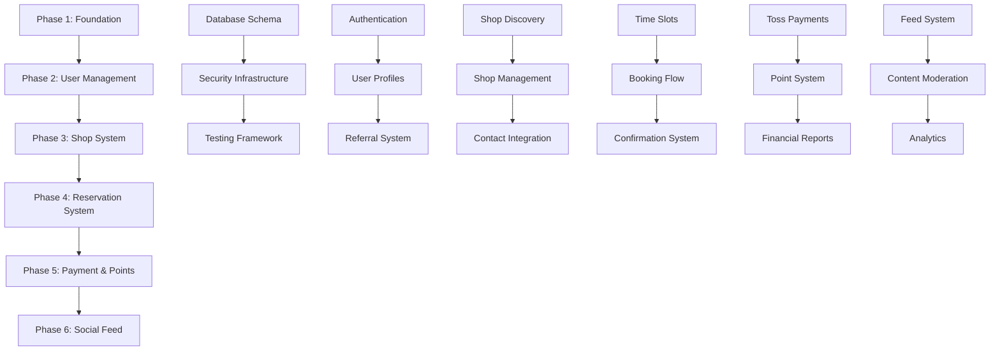

# 에뷰리띵 백엔드 개발 로드맵 - 전체 개요

## 🗺️ 개발 단계별 개요

### **6단계 체계적 개발 계획**
총 개발 기간: **10-14주** (2.5-3.5개월)



## 📊 단계별 상세 정보

| Phase | Duration | Priority | Key Features | Dependencies |
|-------|----------|----------|--------------|--------------|
| **1. Foundation** | 1-2주 | Critical | DB Schema, Security, Testing | None |
| **2. User Management** | 1-2주 | High | Auth, Profiles, Referrals | Phase 1 |
| **3. Shop System** | 2-3주 | High | Discovery, Management, Contact | Phase 1-2 |
| **4. Reservation** | 2-3주 | Critical | Booking, Confirmation, Completion | Phase 1-3 |
| **5. Payment & Points** | 2-3주 | Critical | Payments, Points, Rewards | Phase 1-4 |
| **6. Social Feed** | 2-3주 | Medium | Feed, Moderation, Analytics | Phase 1-5 |

## 🎯 각 단계별 핵심 목표

### Phase 1: Foundation & Infrastructure
**목표**: 견고한 개발 기반 구축
- ✅ TypeScript + Express.js + Supabase 환경 설정
- ✅ 전체 데이터베이스 스키마 구현 (21개 테이블)
- ✅ 보안 인프라 (JWT, RBAC, Rate Limiting)
- ✅ 테스트 프레임워크 (Unit, Integration, Security)
- ✅ 모니터링 및 로깅 시스템

### Phase 2: User Management & Authentication
**목표**: 사용자 관리 시스템 완성
- 📱 소셜 로그인 (카카오, 애플, 구글) 통합
- 👤 사용자 등록 및 프로필 관리
- 🔗 추천인 시스템 (코드 생성, 추적)
- ⚙️ 사용자 설정 및 권한 관리
- 👨‍💼 관리자 사용자 관리 도구

### Phase 3: Shop Management & Discovery
**목표**: 샵 마켓플레이스 구축
- 🗺️ 위치 기반 샵 검색 (PostGIS 최적화)
- 🏪 샵 등록 및 승인 워크플로우
- 📸 샵 프로필 및 이미지 관리
- 📞 샵 연락처 통합 (v3.2 카카오톡 채널)
- 🔍 고급 검색 및 필터링

### Phase 4: Reservation & Booking System
**목표**: 예약 시스템 핵심 구현
- ⏰ 실시간 시간 슬롯 가용성 확인
- 📝 예약 요청 플로우 (v3.1 업데이트)
- ✅ 샵 사장 확정 시스템
- ✨ 서비스 완료 및 포인트 적립
- ❌ 취소 및 환불 정책 (v3.2)

### Phase 5: Payment Processing & Point System
**목표**: 결제 및 리워드 시스템
- 💳 토스페이먼츠 통합 (예약금 + 잔금)
- 💎 포인트 시스템 (v3.2 정책: 30만원 한도, 2.5% 적립)
- 🎁 추천인 리워드 (인플루언서 2배 보너스)
- 📊 재정 관리 및 정산 시스템
- 🔒 결제 보안 및 사기 방지

### Phase 6: Social Feed & Advanced Features
**목표**: 소셜 기능 및 고급 분석
- 📱 인스타그램 스타일 피드 시스템
- 🛡️ 콘텐츠 자동 조정 및 신고 시스템
- 📈 고급 분석 및 비즈니스 인텔리전스
- ⚡ 성능 최적화 및 확장성
- 📊 종합 모니터링 및 알림

## 🔄 단계별 의존성 관리

### 순차적 의존성
```
Phase 1 → Phase 2 → Phase 3 → Phase 4 → Phase 5 → Phase 6
```

### 병렬 개발 가능 영역
- **Phase 3-4**: 샵 시스템과 예약 시스템 일부 병렬 개발 가능
- **Phase 5-6**: 결제 시스템과 피드 시스템 독립적 개발 가능
- **Testing**: 모든 단계에서 지속적 테스트 가능

## 📋 품질 관리 기준

### 각 단계별 완료 조건
1. **기능 완성도**: 모든 명세된 API 구현 완료
2. **테스트 커버리지**: 단위 테스트 >85%, 통합 테스트 >80%
3. **성능 기준**: 응답 시간, 처리량, 메모리 사용량 목표 달성
4. **보안 검증**: 보안 테스트 통과, 취약점 해결
5. **문서화**: API 문서, 기술 문서 업데이트 완료

### 코드 품질 기준
- **TypeScript**: Strict mode, 타입 안전성 100%
- **ESLint**: 코드 품질 점수 >95%
- **Prettier**: 일관된 코드 포맷팅
- **Jest**: 테스트 커버리지 >85%

## 🚨 위험 관리 전략

### 기술적 위험
- **복잡성 관리**: 각 단계별 명확한 범위 정의
- **성능 이슈**: 단계별 성능 테스트 및 최적화
- **통합 문제**: 단계 간 인터페이스 명확히 정의

### 비즈니스 위험
- **일정 지연**: 버퍼 시간 포함, 우선순위 조정 가능
- **요구사항 변경**: 각 단계별 독립성 확보
- **품질 저하**: 각 단계별 품질 게이트 운영

## 📈 성공 지표

### 개발 프로세스 지표
- **일정 준수율**: 각 단계 예정 기간 내 완료
- **품질 지표**: 버그 발생률, 테스트 커버리지
- **성능 지표**: 응답 시간, 처리량, 안정성

### 비즈니스 지표
- **기능 완성도**: 요구사항 구현률
- **사용자 경험**: API 사용성, 오류율
- **시스템 안정성**: 가동 시간, 오류 복구 시간

## 🛠️ 개발 도구 및 환경

### 필수 개발 도구
```bash
# 개발 환경
Node.js 18+, TypeScript 5.0+, Express.js 4.18+

# 데이터베이스
Supabase PostgreSQL + PostGIS

# 테스팅
Jest, Supertest, Artillery (성능 테스트)

# 모니터링
Winston (로깅), Prometheus (메트릭), Grafana (대시보드)

# 보안
Helmet, express-rate-limit, Joi (검증)
```

### CI/CD 파이프라인
```yaml
# GitHub Actions workflow
stages:
  - lint_and_format
  - unit_tests
  - integration_tests
  - security_tests
  - build_and_deploy
  - performance_tests
  - health_checks
```

## 🎯 최종 목표

### 완성된 시스템 특징
- **확장 가능**: 10만+ 사용자 지원 가능한 아키텍처
- **안전함**: 엔터프라이즈급 보안 및 데이터 보호
- **빠름**: 95%ile 응답 시간 <200ms
- **신뢰할 수 있음**: 99.9% 가동 시간, 자동 복구
- **관찰 가능**: 종합 모니터링 및 알림 시스템

### 비즈니스 가치
- **사용자 경험**: 직관적이고 빠른 뷰티 서비스 예약
- **샵 파트너**: 효율적인 예약 관리 및 고객 소통
- **플랫폼 성장**: 소셜 기능으로 사용자 참여 증대
- **수익 모델**: 수수료, 광고, 프리미엄 기능

---

## 📚 관련 문서

- [Phase 1: Foundation Setup](./phase-1-foundation-setup.md)
- [Phase 2: User Management](./phase-2-user-management.md)  
- [Phase 3: Shop System](./phase-3-shop-system.md)
- [Phase 4: Reservation System](./phase-4-reservation-system.md)
- [Phase 5: Payment & Point System](./phase-5-payment-point-system.md)
- [Phase 6: Social Feed System](./phase-6-social-feed-system.md)

---
*이 로드맵은 에뷰리띵 플랫폼의 체계적이고 안정적인 개발을 보장합니다.*
